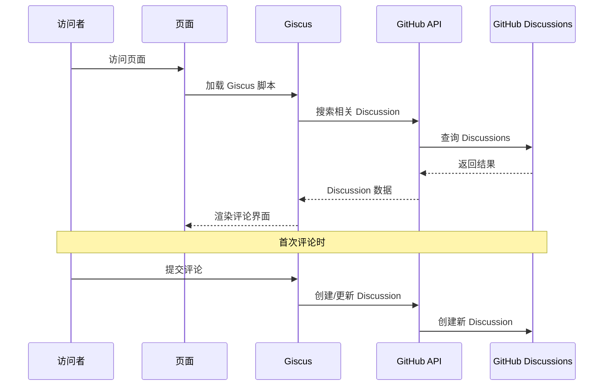

# Hexo Comments Giscus

[](https://www.npmjs.com/package/hexo-comments-giscus)
[](https://nodejs.org/en/download/)
[](https://hexo.io/)
[](https://github.com/huazie/diversity-plugins/blob/main/packages/hexo-comments-giscus/LICENSE)
[](https://github.com/huazie/diversity-plugins/stargazers)

轻松集成 [Giscus](https://giscus.app/) 评论系统到您的 Hexo 博客中，基于 GitHub Discussions 的现代化评论解决方案。

[英文说明/English Documentation](README_EN.md)

## 功能特性

| 特性 | 描述 | 优势 |
|------|------|------|
| **GitHub Discussions** | 基于 GitHub Discussions，无需数据库 | 零维护成本，高可用性 |
| **安全可靠** | 完全开源，无广告无追踪 | 保护用户隐私，透明可信 |
| **主题切换** | 支持亮色/暗色主题自动切换 | 完美适配各种主题风格 |
| **响应式设计** | 适配各种设备屏幕 | 移动端友好的用户体验 |
| **即时加载** | 支持懒加载和加载动画 | 优化页面性能 |
| **多语言支持** | 支持多种界面语言 | 国际化友好 |
| **易于配置** | 简单的 YAML 配置 | 快速上手，灵活定制 |

## 快速开始

### 安装插件

```bash
# 1. 安装多评论系统核心插件（必需）
npm install hexo-generator-comments --save

# 2. 安装 Giscus 评论插件
npm install hexo-comments-giscus --save
```

> **提示**：`hexo-comments-giscus` 需要与 `hexo-generator-comments` 搭配使用
> 更多信息：[hexo-generator-comments](https://github.com/huazie/diversity-plugins/tree/main/packages/hexo-generator-comments)

## 配置指南

### 基本配置

在 Hexo 站点配置 `_config.yml` 或 主题配置 `_config.yml` 、`_config.[theme].yml` 中添加以下内容：

```yaml
giscus:
  # 是否启用 Giscus 评论系统
  enable: false
  # 是否显示加载动画
  loading: true
  # GitHub 仓库，格式为 username/repo-name
  repo: your-username/your-repo-name
  # GitHub 仓库的唯一ID
  repo_id: your-repo-id
  # GitHub Discussions 分类名称
  category: General
  # Discussions 分类的唯一 ID
  category_id: your-category-id
  # 指定 GitHub discussion 的匹配规则
  mapping: pathname
  # 当 mapping 为 specific 时的特定术语
  term: 
  # 是否启用严格的标题匹配
  strict: 0
  # 是否启用主帖子上的反应
  reactions_enabled: 1
  # 是否输出 discussion 的元数据
  emit_metadata: 0
  # 亮色主题
  theme: light
  # 暗色主题
  dark: dark
  # 评论区的语言
  lang: 
  # 评论输入框的位置
  input_position: bottom
  # 懒加载评论
  data_loading: lazy
```

> **重要**：请将配置中的占位符替换为您的实际 GitHub 仓库信息

### 配置选项详解

| 选项 | 类型 | 默认值 | 必填 | 描述 |
|------|------|--------|------|------|
| `enable` | Boolean | `false` | 是 | 是否启用 Giscus 评论系统 |
| `loading` | Boolean | `true` | 是 | 是否显示评论加载动画 |
| `repo` | String | - | 是 | GitHub 仓库，格式：`username/repo-name` |
| `repo_id` | String | - | 是 | GitHub 仓库的唯一ID |
| `category` | String | - | 是 | GitHub Discussions 分类名称 |
| `category_id` | String | - | 是 | Discussions 分类的唯一 ID |
| `mapping` | String | `pathname` | 是 | GitHub discussion 的匹配规则 |
| `term` | String | - | 否 | 当 mapping 为 specific 时的特定术语 |
| `strict` | Number | `0` | 是 | 是否启用严格的标题匹配 |
| `reactions_enabled` | Number | `1` | 是 | 是否启用主帖子上的反应 |
| `emit_metadata` | Number | `0` | 是 | 是否输出 discussion 的元数据 |
| `theme` | String | `light` | 是 | 亮色模式主题 |
| `dark` | String | `dark` | 是 | 暗色模式主题 |
| `lang` | String | `navigator.language` | 否 | 评论区的语言 |
| `input_position` | String | `bottom` | 否 | 评论输入框的位置 |
| `data_loading` | String | `lazy` | 否 | 懒加载评论 |

### 高级配置选项

**mapping 映射方式**

| 值 | 描述 | 适用场景 |
|---|------|----------|
| `pathname` | 使用页面路径作为 discussion 标题 | **推荐**，适合大多数场景 |
| `url` | 使用页面完整 URL 作为 discussion 标题 | 需要包含域名信息时 |
| `title` | 使用页面标题作为 discussion 标题 | 希望 discussion 标题更友好 |
| `og:title` | 使用页面 Open Graph 标题 | SEO 优化场景 |
| `specific` | 使用特定术语作为标题 | 自定义标识符 |

**主题样式选项**

| 主题名 | 特点 |
|--------|------|
| `light` | 标准亮色主题 |
| `light_high_contrast` | 高对比度亮色主题 |
| `light_protanopia` | 红绿色盲友好亮色主题 |
| `light_tritanopia` | 蓝黄色盲友好亮色主题 |
| `dark` | 标准暗色主题 |
| `dark_high_contrast` | 高对比度暗色主题 |
| `dark_protanopia` | 红绿色盲友好暗色主题 |
| `dark_tritanopia` | 蓝黄色盲友好暗色主题 |
| `dark_dimmed` | 暗淡的暗色主题 |
| `preferred_color_scheme` | 自动跟随系统主题 |
| `transparent_dark` | 透明暗色主题 |
| `noborder_light` | 无边框亮色主题 |
| `noborder_dark` | 无边框暗色主题 |
| `noborder_gray` | 无边框灰色主题 |
| `cobalt` | 钴蓝主题 |
| `purple_dark` | 紫色暗主题 |

**语言选项**

| 语言代码 | 语言名称 |
|----------|----------|
| `zh-CN` | 简体中文 |
| `zh-TW` | 繁体中文 |
| `en` | 英文 |
| `es-ES` | 西班牙语 |
| `fr` | 法语 |
| `ru` | 俄语 |
| ... | ... |

### 支持的模板引擎

本插件支持所有使用以下模板引擎的 Hexo 主题：

| 模板引擎 | 文件扩展名 | 支持状态 |
|----------|------------|----------|
| **EJS** | `.ejs` | ✅ 完全支持 |
| **Nunjucks** | `.njk` | ✅ 完全支持 |
| **JSX + Inferno** | `.jsx` | ✅ 完全支持 |

## 使用前提

在开始使用之前，请确保满足以下条件：

### 1. GitHub 仓库准备
- 拥有一个 **公开的** GitHub 仓库
- 仓库已启用 Discussions 功能

### 2. 安装 Giscus App
- 访问 [Giscus GitHub App](https://github.com/apps/giscus)
- 点击 "Install" 并选择您的仓库
- 授权 Giscus 访问您的仓库

### 3. 获取配置参数
- 访问 [Giscus 官网](https://giscus.app/)
- 按照指引获取 `repo_id` 和 `category_id` 等参数

> **提示**：Giscus App 只需要 Discussions 的读写权限，非常安全

## 工作原理



### 详细流程

1. **页面加载**：访问者打开页面，Giscus 脚本开始工作
2. **搜索 Discussion**：根据配置的 `mapping` 在指定仓库的 Discussions 中搜索相关讨论
3. **显示评论**：如果找到对应 Discussion，显示其中的评论
4. **创建 Discussion**：首次评论时，自动创建新的 Discussion
5. **GitHub 登录**：访问者需要 GitHub 账号才能参与评论

## 系统要求

| 依赖 | 版本要求 | 说明 |
|------|----------|------|
| **Node.js** | >= 14.0.0 | JavaScript 运行环境 |
| **Hexo** | >= 5.3.0 | 静态站点生成器 |
| **GitHub 仓库** | 公开仓库 | 存储评论数据 |

## 相关链接

### 官方资源
- [Giscus 官网](https://giscus.app/)
- [Giscus GitHub App](https://github.com/apps/giscus)
- [GitHub Discussions 文档](https://docs.github.com/en/discussions)

### Hexo 文档
- [Hexo 官方文档](https://hexo.io/zh-cn/docs/)
- [Hexo 配置文档](https://hexo.io/zh-cn/docs/configuration)
- [Hexo 插件开发文档](https://hexo.io/zh-cn/docs/plugins)

### 相关插件
- [hexo-generator-comments](https://github.com/huazie/diversity-plugins/tree/main/packages/hexo-generator-comments) - 多评论系统核心插件
- [hexo-comments-utterances](https://github.com/huazie/diversity-plugins/tree/main/packages/hexo-comments-utterances) - Utterances 评论插件
- [hexo-comments-gitalk](https://github.com/huazie/diversity-plugins/tree/main/packages/hexo-comments-gitalk) - Gitalk 评论插件

## 许可证

本项目基于 [MIT](LICENSE) 许可证开源。