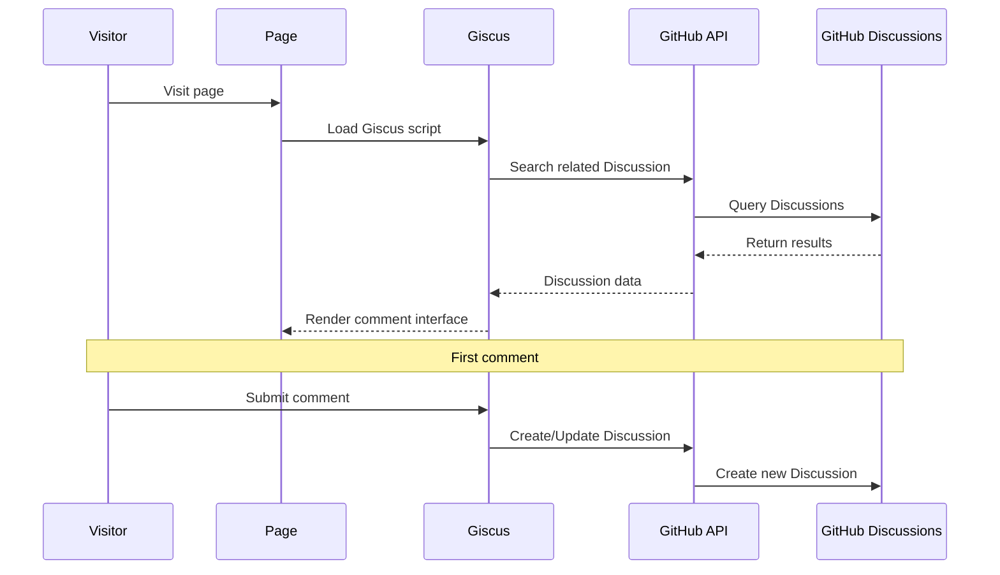

# Hexo Comments Giscus

[](https://www.npmjs.com/package/hexo-comments-giscus)
[](https://nodejs.org/en/download/)
[](https://hexo.io/)
[](https://github.com/huazie/diversity-plugins/blob/main/packages/hexo-comments-giscus/LICENSE)
[](https://github.com/huazie/diversity-plugins/stargazers)

Easily integrate the [Giscus](https://giscus.app/) comment system into your Hexo blog, a modern comment solution based on GitHub Discussions.

[中文说明/Chinese Documentation](README.md)

## Features

| Feature | Description | Advantages |
|------|------|------|
| **GitHub Discussions** | Based on GitHub Discussions, no database required | Zero maintenance cost, high availability |
| **Secure & Reliable** | Fully open source, no ads or tracking | Protects user privacy, transparent and trustworthy |
| **Theme Switching** | Supports light/dark theme auto-switching | Perfectly adapts to various theme styles |
| **Responsive Design** | Adapts to various device screens | Mobile-friendly user experience |
| **Instant Loading** | Supports lazy loading and loading animations | Optimizes page performance |
| **Multi-language Support** | Supports multiple interface languages | Internationalization friendly |
| **Easy Configuration** | Simple YAML configuration | Quick setup, flexible customization |

## Quick Start

### Installation

```bash
# 1. Install multi-comment system core plugin (required)
npm install hexo-generator-comments --save

# 2. Install Giscus comment plugin
npm install hexo-comments-giscus --save
```

> **Note**: `hexo-comments-giscus` needs to be used with `hexo-generator-comments`
> More info: [hexo-generator-comments](https://github.com/huazie/diversity-plugins/tree/main/packages/hexo-generator-comments)

## Configuration Guide

### Basic Configuration

Add the following content to your Hexo site configuration `_config.yml` or theme configuration `_config.yml`, `_config.[theme].yml`:

```yaml
giscus:
  # Enable Giscus comment system
  enable: false
  # Show loading animation
  loading: true
  # GitHub repository, format: username/repo-name
  repo: your-username/your-repo-name
  # GitHub repository unique ID
  repo_id: your-repo-id
  # GitHub Discussions category name
  category: General
  # Discussions category unique ID
  category_id: your-category-id
  # GitHub discussion mapping rule
  mapping: pathname
  # Specific term when mapping is 'specific'
  term: 
  # Enable strict title matching
  strict: 0
  # Enable reactions on main post
  reactions_enabled: 1
  # Emit discussion metadata
  emit_metadata: 0
  # Light theme
  theme: light
  # Dark theme
  dark: dark
  # Comment section language
  lang: 
  # Comment input position
  input_position: bottom
  # Lazy load comments
  data_loading: lazy
```

> **Important**: Replace the placeholders in the configuration with your actual GitHub repository information

### Configuration Options Details

| Option | Type | Default | Required | Description |
|------|------|--------|------|------|
| `enable` | Boolean | `false` | Yes | Enable Giscus comment system |
| `loading` | Boolean | `true` | Yes | Show comment loading animation |
| `repo` | String | - | Yes | GitHub repository, format: `username/repo-name` |
| `repo_id` | String | - | Yes | GitHub repository unique ID |
| `category` | String | - | Yes | GitHub Discussions category name |
| `category_id` | String | - | Yes | Discussions category unique ID |
| `mapping` | String | `pathname` | Yes | GitHub discussion mapping rule |
| `term` | String | - | No | Specific term when mapping is 'specific' |
| `strict` | Number | `0` | Yes | Enable strict title matching |
| `reactions_enabled` | Number | `1` | Yes | Enable reactions on main post |
| `emit_metadata` | Number | `0` | Yes | Emit discussion metadata |
| `theme` | String | `light` | Yes | Light mode theme |
| `dark` | String | `dark` | Yes | Dark mode theme |
| `lang` | String | `navigator.language` | No | Comment section language |
| `input_position` | String | `bottom` | No | Comment input position |
| `data_loading` | String | `lazy` | No | Lazy load comments |

### Advanced Configuration Options

**mapping Methods**

| Value | Description | Use Cases |
|---|------|----------|
| `pathname` | Use page path as discussion title | **Recommended**, suitable for most scenarios |
| `url` | Use full page URL as discussion title | When domain information is needed |
| `title` | Use page title as discussion title | When you want more friendly discussion titles |
| `og:title` | Use page Open Graph title | SEO optimization scenarios |
| `specific` | Use specific term as title | Custom identifiers |

**Theme Style Options**

| Theme Name | Characteristics |
|--------|------|
| `light` | Standard light theme |
| `light_high_contrast` | High contrast light theme |
| `light_protanopia` | Protanopia-friendly light theme |
| `light_tritanopia` | Tritanopia-friendly light theme |
| `dark` | Standard dark theme |
| `dark_high_contrast` | High contrast dark theme |
| `dark_protanopia` | Protanopia-friendly dark theme |
| `dark_tritanopia` | Tritanopia-friendly dark theme |
| `dark_dimmed` | Dimmed dark theme |
| `preferred_color_scheme` | Auto-follow system theme |
| `transparent_dark` | Transparent dark theme |
| `noborder_light` | Borderless light theme |
| `noborder_dark` | Borderless dark theme |
| `noborder_gray` | Borderless gray theme |
| `cobalt` | Cobalt blue theme |
| `purple_dark` | Purple dark theme |

**Language Options**

| Language Code | Language Name |
|----------|----------|
| `zh-CN` | Simplified Chinese |
| `zh-TW` | Traditional Chinese |
| `en` | English |
| `es-ES` | Spanish |
| `fr` | French |
| `ru` | Russian |
| ... | ... |

### Supported Template Engines

This plugin supports all Hexo themes using the following template engines:

| Template Engine | File Extension | Support Status |
|-----------------|----------------|----------------|
| **EJS** | `.ejs` | ✅ Fully Supported |
| **Nunjucks** | `.njk` | ✅ Fully Supported |
| **JSX + Inferno** | `.jsx` | ✅ Fully Supported |

## Prerequisites

Before getting started, please ensure the following requirements are met:

### 1. GitHub Repository Preparation
- Have a **public** GitHub repository
- Discussions feature is enabled for the repository

### 2. Install Giscus App
- Visit [Giscus GitHub App](https://github.com/apps/giscus)
- Click "Install" and select your repository
- Authorize Giscus to access your repository

### 3. Get Configuration Parameters
- Visit [Giscus Official Website](https://giscus.app/)
- Follow the instructions to get `repo_id` and `category_id` parameters

> **Note**: Giscus App only requires read-write permissions for Discussions, very secure

## How It Works



### Detailed Process

1. **Page Loading**: Visitor opens the page, Giscus script starts working
2. **Search Discussion**: Search for related discussions in the specified repository's Discussions based on configured `mapping`
3. **Display Comments**: If corresponding discussion is found, display comments from it
4. **Create Discussion**: When commenting for the first time, automatically create a new discussion
5. **GitHub Login**: Visitors need a GitHub account to participate in comments

## System Requirements

| Dependency | Version Requirement | Description |
|------|----------|------|
| **Node.js** | >= 14.0.0 | JavaScript runtime environment |
| **Hexo** | >= 5.3.0 | Static site generator |
| **GitHub Repository** | Public repository | Stores comment data |

## Related Links

### Official Resources
- [Giscus Official Website](https://giscus.app/)
- [Giscus GitHub App](https://github.com/apps/giscus)
- [GitHub Discussions Documentation](https://docs.github.com/en/discussions)

### Hexo Documentation
- [Hexo Official Documentation](https://hexo.io/docs/)
- [Hexo Configuration Documentation](https://hexo.io/docs/configuration)
- [Hexo Plugin Development Documentation](https://hexo.io/docs/plugins)

### Related Plugins
- [hexo-generator-comments](https://github.com/huazie/diversity-plugins/tree/main/packages/hexo-generator-comments) - Multi-comment system core plugin
- [hexo-comments-utterances](https://github.com/huazie/diversity-plugins/tree/main/packages/hexo-comments-utterances) - Utterances comment plugin
- [hexo-comments-gitalk](https://github.com/huazie/diversity-plugins/tree/main/packages/hexo-comments-gitalk) - Gitalk comment plugin

## License

This project is open source under the [MIT](LICENSE) license.