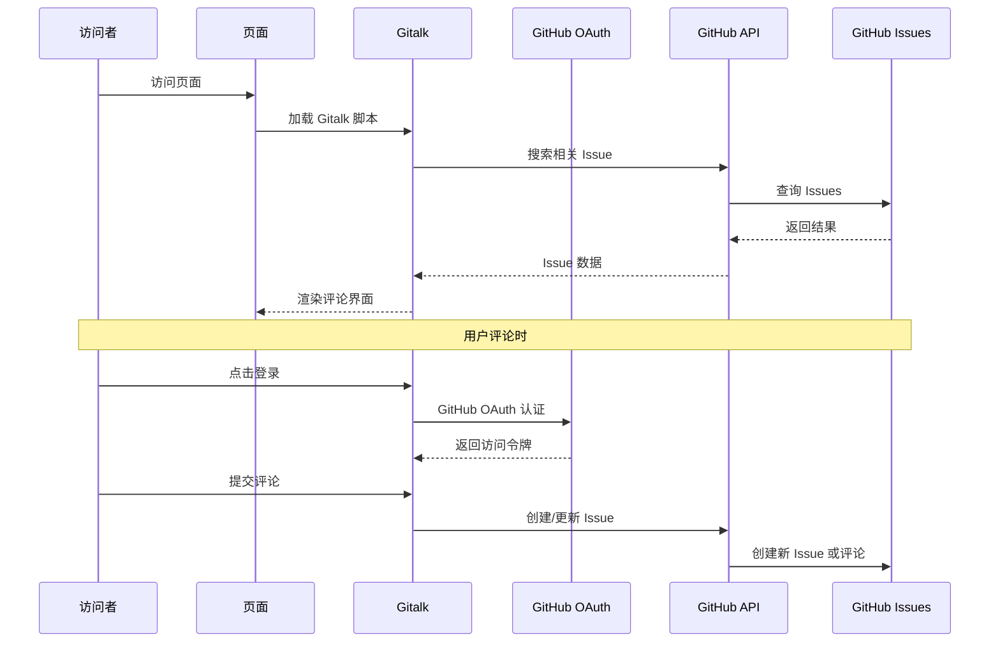

# Hexo Comments Gitalk

[](https://www.npmjs.com/package/hexo-comments-gitalk)
[](https://nodejs.org/en/download/)
[](https://hexo.io/)
[](https://github.com/huazie/diversity-plugins/blob/main/packages/hexo-comments-gitalk/LICENSE)
[](https://github.com/huazie/diversity-plugins/stargazers)

轻松集成 [Gitalk](https://github.com/gitalk/gitalk) 评论系统到您的 Hexo 博客中，基于 GitHub Issues 的现代化评论解决方案。

[英文说明/English Documentation](README_EN.md)

## 功能特性

| 特性 | 描述 | 优势 |
|------|------|------|
| **GitHub 集成** | 基于 GitHub Issues，无需数据库 | 零维护成本，高可用性 |
| **OAuth 认证** | 支持 GitHub OAuth 安全登录 | 保护用户隐私，安全可靠 |
| **主题切换** | 支持亮色/暗色主题自动切换 | 完美适配各种主题风格 |
| **响应式设计** | 适配各种设备屏幕 | 移动端友好的用户体验 |
| **多语言支持** | 支持多种界面语言 | 国际化友好 |
| **易于配置** | 简单的 YAML 配置 | 快速上手，灵活定制 |

## 快速开始

### 安装插件

```bash
# 1. 安装多评论系统核心插件（必需）
npm install hexo-generator-comments --save

# 2. 安装 Gitalk 评论插件
npm install hexo-comments-gitalk --save
```

> **提示**：`hexo-comments-gitalk` 需要与 `hexo-generator-comments` 搭配使用
> 更多信息：[hexo-generator-comments](https://github.com/huazie/diversity-plugins/tree/main/packages/hexo-generator-comments)

## 配置指南

### 基本配置

在 Hexo 站点配置 `_config.yml` 或 主题配置 `_config.yml` 、`_config.[theme].yml` 中添加以下内容：

```yaml
gitalk:
  # 是否启用 Gitalk 评论系统
  enable: false
  # GitHub Application Client ID
  client_id: your-client-id
  # GitHub Application Client Secret
  client_secret: your-client-secret
  # GitHub 仓库名称
  repo: your-repo-name
  # GitHub 仓库所有者
  github_id: your-github-id
  # GitHub 仓库管理员
  admin_user: your-github-id
  # 页面唯一标识
  issue_term: pathname
  # 语言设置
  language: 
  # 是否启用无干扰模式
  distraction_free_mode: true
  # 代理 URL（可选）
  proxy: https://cors-anywhere.azm.workers.dev/https://github.com/login/oauth/access_token
```

> **重要**：请将配置中的占位符替换为您的实际 GitHub 应用信息

### 配置选项详解

| 选项 | 类型 | 默认值 | 必填 | 描述 |
|------|------|--------|------|------|
| `enable` | Boolean | `false` | 是 | 是否启用 Gitalk 评论系统 |
| `client_id` | String | - | 是 | GitHub Application 的 Client ID |
| `client_secret` | String | - | 是 | GitHub Application 的 Client Secret |
| `repo` | String | - | 是 | 用于存储评论的 GitHub 仓库名称 |
| `github_id` | String | - | 是 | GitHub 仓库所有者的用户名 |
| `admin_user` | String | - | 是 | GitHub 仓库管理员的用户名 |
| `issue_term` | String | `pathname` | 是 | 页面唯一标识的生成方式 |
| `language` | String | `navigator.language` | 否 | 界面语言设置 |
| `distraction_free_mode` | Boolean | `true` | 是 | 是否启用无干扰模式 |
| `proxy` | String | - | 否 | 代理 URL，用于解决 CORS 问题 |

### 高级配置选项

**issue_term 映射方式**

| 值 | 描述 | 适用场景 |
|---|------|----------|
| `pathname` | 使用页面路径作为 issue 标题 | **推荐**，适合大多数场景 |
| `url` | 使用页面完整 URL 作为 issue 标题 | 需要包含域名信息时 |
| `title` | 使用页面标题作为 issue 标题 | 希望 issue 标题更友好 |
| `[issue-number]` | 指定特定的 issue 编号 | 手动管理评论 |

**language 语言选项**

| 语言代码 | 语言名称 |
|----------|----------|
| `en` | 英文 |
| `zh-CN` | 简体中文 |
| `zh-TW` | 繁体中文 |
| `es-ES` | 西班牙语 |
| `fr` | 法语 |
| `ru` | 俄语 |
| ... | ... |

### 支持的模板引擎

本插件支持所有使用以下模板引擎的 Hexo 主题：

| 模板引擎 | 文件扩展名 | 支持状态 |
|----------|------------|----------|
| **EJS** | `.ejs` | ✅ 完全支持 |
| **Nunjucks** | `.njk` | ✅ 完全支持 |
| **JSX + Inferno** | `.jsx` | ✅ 完全支持 |

## 使用前提

在开始使用之前，请确保满足以下条件：

### 1. GitHub 仓库准备
- 拥有一个 **公开的** GitHub 仓库
- 仓库已启用 Issues 功能

### 2. 创建 GitHub OAuth 应用
- 访问 [GitHub OAuth 应用设置](https://github.com/settings/applications/new)
- 创建新的 OAuth 应用
- 获取 Client ID 和 Client Secret

> **提示**：OAuth 应用的 Authorization callback URL 可以设置为您的博客域名

## 工作原理



### 详细流程

1. **页面加载**：访问者打开页面，Gitalk 脚本开始工作
2. **搜索 Issue**：根据配置的 `issue_term` 在指定仓库中搜索相关 Issue
3. **显示评论**：如果找到对应 Issue，显示其中的评论
4. **OAuth 认证**：访问者需要通过 GitHub OAuth 登录才能评论
5. **创建 Issue**：管理员首次访问页面时，自动创建新的 Issue

## 系统要求

| 依赖 | 版本要求 | 说明 |
|------|----------|------|
| **Node.js** | >= 14.0.0 | JavaScript 运行环境 |
| **Hexo** | >= 5.3.0 | 静态站点生成器 |
| **GitHub 仓库** | 公开仓库 | 存储评论数据 |

## 相关链接

### 官方资源
- [Gitalk 官方文档](https://github.com/gitalk/gitalk)
- [GitHub OAuth 应用设置](https://github.com/settings/applications/new)
- [GitHub Issues 文档](https://docs.github.com/en/issues)

### Hexo 文档
- [Hexo 官方文档](https://hexo.io/zh-cn/docs/)
- [Hexo 配置文档](https://hexo.io/zh-cn/docs/configuration)
- [Hexo 插件开发文档](https://hexo.io/zh-cn/docs/plugins)

### 相关插件
- [hexo-generator-comments](https://github.com/huazie/diversity-plugins/tree/main/packages/hexo-generator-comments) - 多评论系统核心插件
- [hexo-comments-utterances](https://github.com/huazie/diversity-plugins/tree/main/packages/hexo-comments-utterances) - Utterances 评论插件
- [hexo-comments-giscus](https://github.com/huazie/diversity-plugins/tree/main/packages/hexo-comments-giscus) - Giscus 评论插件

## 许可证

本项目基于 [MIT](LICENSE) 许可证开源。