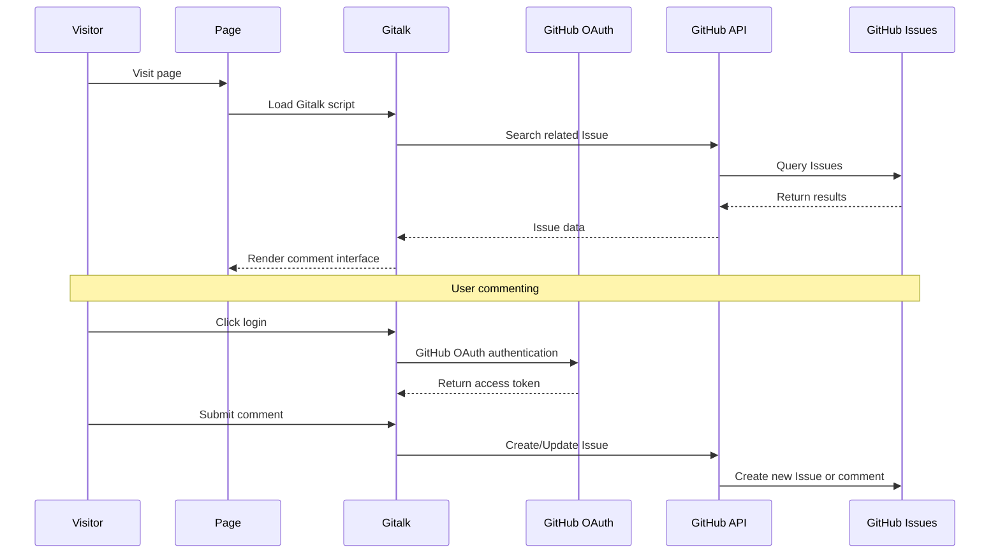

# Hexo Comments Gitalk

[](https://www.npmjs.com/package/hexo-comments-gitalk)
[](https://nodejs.org/en/download/)
[](https://hexo.io/)
[](https://github.com/huazie/diversity-plugins/blob/main/packages/hexo-comments-gitalk/LICENSE)
[](https://github.com/huazie/diversity-plugins/stargazers)

Easily integrate the [Gitalk](https://github.com/gitalk/gitalk) comment system into your Hexo blog, a modern comment solution based on GitHub Issues.

[中文说明/Chinese Documentation](README.md)

## Features

| Feature | Description | Advantages |
|------|------|------|
| **GitHub Integration** | Based on GitHub Issues, no database required | Zero maintenance cost, high availability |
| **OAuth Authentication** | Supports GitHub OAuth secure login | Protects user privacy, secure and reliable |
| **Theme Switching** | Supports light/dark theme auto-switching | Perfectly adapts to various theme styles |
| **Responsive Design** | Adapts to various device screens | Mobile-friendly user experience |
| **Multi-language Support** | Supports multiple interface languages | Internationalization friendly |
| **Easy Configuration** | Simple YAML configuration | Quick setup, flexible customization |

## Quick Start

### Installation

```bash
# 1. Install multi-comment system core plugin (required)
npm install hexo-generator-comments --save

# 2. Install Gitalk comment plugin
npm install hexo-comments-gitalk --save
```

> **Note**: `hexo-comments-gitalk` needs to be used with `hexo-generator-comments`
> More info: [hexo-generator-comments](https://github.com/huazie/diversity-plugins/tree/main/packages/hexo-generator-comments)

## Configuration Guide

### Basic Configuration

Add the following content to your Hexo site configuration `_config.yml` or theme configuration `_config.yml`, `_config.[theme].yml`:

```yaml
gitalk:
  # Enable Gitalk comment system
  enable: false
  # GitHub Application Client ID
  client_id: your-client-id
  # GitHub Application Client Secret
  client_secret: your-client-secret
  # GitHub repository name
  repo: your-repo-name
  # GitHub repository owner
  github_id: your-github-id
  # GitHub repository administrator
  admin_user: your-github-id
  # Page unique identifier
  issue_term: pathname
  # Language settings
  language: 
  # Enable distraction-free mode
  distraction_free_mode: true
  # Proxy URL (optional)
  proxy: https://cors-anywhere.azm.workers.dev/https://github.com/login/oauth/access_token
```

> **Important**: Replace the placeholders in the configuration with your actual GitHub application information

### Configuration Options Details

| Option | Type | Default | Required | Description |
|------|------|--------|------|------|
| `enable` | Boolean | `false` | Yes | Enable Gitalk comment system |
| `client_id` | String | - | Yes | GitHub Application Client ID |
| `client_secret` | String | - | Yes | GitHub Application Client Secret |
| `repo` | String | - | Yes | GitHub repository name for storing comments |
| `github_id` | String | - | Yes | GitHub repository owner's username |
| `admin_user` | String | - | Yes | GitHub repository administrator's username |
| `issue_term` | String | `pathname` | Yes | How to generate page unique identifier |
| `language` | String | `navigator.language` | No | Interface language settings |
| `distraction_free_mode` | Boolean | `true` | Yes | Enable distraction-free mode |
| `proxy` | String | - | No | Proxy URL for solving CORS issues |

### Advanced Configuration Options

**issue_term Mapping Methods**

| Value | Description | Use Cases |
|---|------|----------|
| `pathname` | Use page path as issue title | **Recommended**, suitable for most scenarios |
| `url` | Use full page URL as issue title | When domain information is needed |
| `title` | Use page title as issue title | When you want more friendly issue titles |
| `[issue-number]` | Specify specific issue number | Manual comment management |

**language Options**

| Language Code | Language Name |
|----------|----------|
| `en` | English |
| `zh-CN` | Simplified Chinese |
| `zh-TW` | Traditional Chinese |
| `es-ES` | Spanish |
| `fr` | French |
| `ru` | Russian |
| ... | ... |

## Prerequisites

Before getting started, please ensure the following requirements are met:

### 1. GitHub Repository Preparation
- Have a **public** GitHub repository
- Issues feature is enabled for the repository

### 2. Create GitHub OAuth Application
- Visit [GitHub OAuth App Settings](https://github.com/settings/applications/new)
- Create a new OAuth application
- Obtain Client ID and Client Secret

> **Note**: The Authorization callback URL of the OAuth application can be set to your blog domain

## How It Works



### Detailed Process

1. **Page Loading**: Visitor opens the page, Gitalk script starts working
2. **Search Issue**: Search for related issues in the specified repository based on configured `issue_term`
3. **Display Comments**: If corresponding issue is found, display comments from it
4. **OAuth Authentication**: Visitors need to log in via GitHub OAuth to comment
5. **Create Issue**: When administrator visits the page for the first time, automatically create a new issue

## System Requirements

| Dependency | Version Requirement | Description |
|------|----------|------|
| **Node.js** | >= 14.0.0 | JavaScript runtime environment |
| **Hexo** | >= 5.3.0 | Static site generator |
| **GitHub Repository** | Public repository | Stores comment data |

## Related Links

### Official Resources
- [Gitalk Official Documentation](https://github.com/gitalk/gitalk)
- [GitHub OAuth App Settings](https://github.com/settings/applications/new)
- [GitHub Issues Documentation](https://docs.github.com/en/issues)

### Hexo Documentation
- [Hexo Official Documentation](https://hexo.io/docs/)
- [Hexo Configuration Documentation](https://hexo.io/docs/configuration)
- [Hexo Plugin Development Documentation](https://hexo.io/docs/plugins)

### Related Plugins
- [hexo-generator-comments](https://github.com/huazie/diversity-plugins/tree/main/packages/hexo-generator-comments) - Multi-comment system core plugin
- [hexo-comments-utterances](https://github.com/huazie/diversity-plugins/tree/main/packages/hexo-comments-utterances) - Utterances comment plugin
- [hexo-comments-giscus](https://github.com/huazie/diversity-plugins/tree/main/packages/hexo-comments-giscus) - Giscus comment plugin

## License

This project is open source under the [MIT](LICENSE) license.