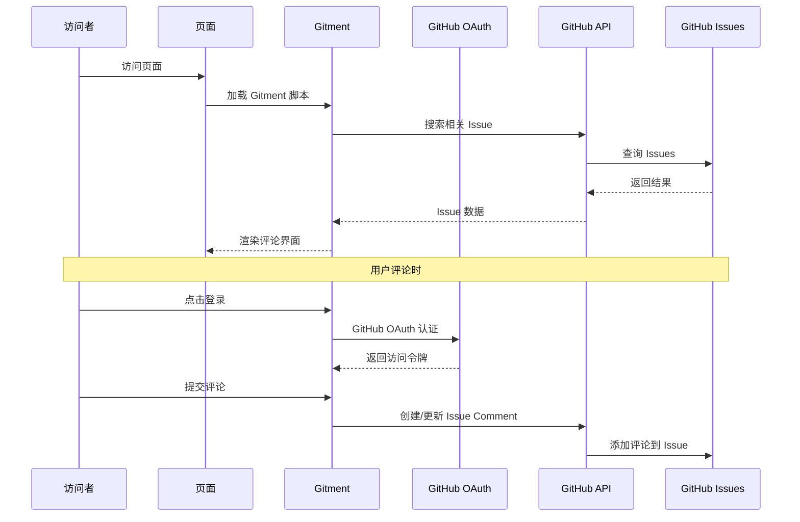

# Hexo Comments Gitment

[](https://www.npmjs.com/package/hexo-comments-gitment)
[](https://nodejs.org/en/download/)
[](https://hexo.io/)
[](https://github.com/huazie/diversity-plugins/blob/main/packages/hexo-comments-gitment/LICENSE)
[](https://github.com/huazie/diversity-plugins/stargazers)

轻松集成 [Gitment](https://github.com/imsun/gitment) 评论系统到您的 Hexo 博客中，基于 GitHub Issues 的轻量级评论解决方案。

[英文说明/English Documentation](README_EN.md)

## 功能特性

| 特性 | 描述 | 优势 |
|------|------|------|
| **GitHub 集成** | 基于 GitHub Issues，无需数据库 | 零维护成本，高可用性 |
| **OAuth 认证** | 支持 GitHub OAuth 安全登录 | 保护用户隐私，安全可靠 |
| **主题切换** | 支持亮色/暗色主题自动切换 | 完美适配各种主题风格 |
| **响应式设计** | 适配各种设备屏幕 | 移动端友好的用户体验 |
| **Markdown 支持** | 支持 Markdown/GFM 语法 | 代码高亮，格式丰富 |
| **易于配置** | 简单的 YAML 配置 | 快速上手，灵活定制 |

## 快速开始

### 安装插件

```bash
# 1. 安装多评论系统核心插件（必需）
npm install hexo-generator-comments --save

# 2. 安装 Gitment 评论插件
npm install hexo-comments-gitment --save
```

> **提示**：`hexo-comments-gitment` 需要与 `hexo-generator-comments` 搭配使用
> 更多信息：[hexo-generator-comments](https://github.com/huazie/diversity-plugins/tree/main/packages/hexo-generator-comments)

## 配置指南

### 基本配置

在 Hexo 站点配置 `_config.yml` 或 主题配置 `_config.yml` 、`_config.[theme].yml` 中添加以下内容：

```yaml
gitment:
  # 是否启用 Gitment 评论系统
  enable: false
  # 是否启用加载提示（评论加载时显示加载动画）
  loading: true
  # GitHub 仓库所有者
  owner: your-github-id
  # 用于存储评论的 GitHub 仓库名
  repo: your-repo-name
  # GitHub Application Client ID
  client_id: your-client-id
  # GitHub Application Client Secret
  client_secret: your-client-secret
  # 指定 GitHub Issue 的匹配规则，配置了这个会替换 id 属性的值
  # 其中 pathname | url | title 用来匹配 issue 的标签，`自定义字符串` 是自定义其他页面唯一标识
  issue_term: pathname
  # 页面唯一标识（可选，默认使用 window.location.href）
  id: 
  # 页面标题（可选，默认使用 document.title）
  title: 
  # 页面链接（可选，默认使用 window.location.href）
  link: 
  # 页面描述（可选）
  desc: 
  # Issue 标签列表（可选）
  labels: []
  # 评论每页显示数量（可选，默认 20）
  per_page: 20
  # 评论最大高度限制（px），超过则折叠（可选，默认 250）
  max_comment_height: 250
  # OAuth 代理地址（可选），默认代理 gh-oauth.imsun.net 已失效，需自行部署
  proxy:
```

> **重要**：请将配置中的占位符替换为您的实际 GitHub 应用信息

### 配置选项详解

| 选项 | 类型 | 默认值 | 必填 | 描述 |
|------|------|--------|------|------|
| `enable` | Boolean | `false` | 是 | 是否启用 Gitment 评论系统 |
| `loading` | Boolean | `true` | 否 | 是否启用加载提示（评论加载时显示加载动画） |
| `owner` | String | - | 是 | GitHub 仓库所有者的用户名 |
| `repo` | String | - | 是 | 用于存储评论的 GitHub 仓库名称 |
| `client_id` | String | - | 是 | GitHub Application 的 Client ID |
| `client_secret` | String | - | 是 | GitHub Application 的 Client Secret |
| `issue_term` | String | `pathname` | 否 | Issue 匹配规则，可选值见下方说明 |
| `id` | String | `window.location.href` | 否 | 页面唯一标识，用于区分不同页面的评论 |
| `title` | String | `document.title` | 否 | 页面标题，用作 issue 的标题 |
| `link` | String | `window.location.href` | 否 | 页面链接，用于 issue 的正文中 |
| `desc` | String | `''` | 否 | 页面描述，用于 issue 的正文中 |
| `labels` | Array | `[]` | 否 | 创建 issue 时添加的标签列表 |
| `per_page` | Number | `20` | 否 | 评论每页显示数量 |
| `max_comment_height` | Number | `250` | 否 | 评论最大高度限制（px），超过则折叠 |
| `proxy` | String | - | 否 | OAuth 代理地址，用于解决认证问题 |

### 高级配置选项

**issue_term 映射方式**

| 值 | 描述 | 适用场景 |
|---|------|----------|
| `pathname` | 使用页面路径作为页面唯一标识 | **推荐**，适合大多数场景 |
| `url` | 使用页面完整 URL 作为页面唯一标识 | 需要包含域名信息时 |
| `title` | 使用页面标题作为页面唯一标识 | 希望 issue 标题更友好 |
| `[自定义字符串]` | 指定自定义的唯一标识 | 手动管理评论 |

**proxy 代理说明**

由于 Gitment 默认的 OAuth 代理 `gh-oauth.imsun.net` 已失效，用户登录时会报 `ERR_SSL_PROTOCOL_ERROR`。你需要自行部署一个 OAuth 代理服务，常见方案：

- **Vercel Serverless** — 部署一个简单的代理函数
- **Cloudflare Workers** — 使用 Workers 转发请求
- **自建服务器** — 部署 Node.js 代理

部署好后，将代理地址配置到 `proxy` 字段即可：

```yaml
gitment:
  proxy: https://your-proxy-server.com
```

### 支持的模板引擎

本插件支持所有使用以下模板引擎的 Hexo 主题：

| 模板引擎 | 文件扩展名 | 支持状态 |
|----------|------------|----------|
| **EJS** | `.ejs` | ✅ 完全支持 |
| **Nunjucks** | `.njk` | ✅ 完全支持 |
| **JSX + Inferno** | `.jsx` | ✅ 完全支持 |

## 使用前提

在开始使用之前，请确保满足以下条件：

### 1. GitHub 仓库准备
- 拥有一个 **公开的** GitHub 仓库
- 仓库已启用 Issues 功能

### 2. 创建 GitHub OAuth 应用
- 访问 [GitHub OAuth 应用设置](https://github.com/settings/applications/new)
- 创建新的 OAuth 应用
- 获取 Client ID 和 Client Secret

> **提示**：OAuth 应用的 Authorization callback URL 可以设置为您的博客域名

### 3. 部署 OAuth 代理（重要）

由于 Gitment 默认的 OAuth 代理 `gh-oauth.imsun.net` 已失效，登录时会报 `ERR_SSL_PROTOCOL_ERROR`。

你需要自行部署一个 OAuth 代理服务。以下是两种部署方式的示例（部署后复制地址填入 `proxy`）：

- **Netlify 云函数示例（`netlify/functions/auth.js`）：**

> 完整项目参考：[github-oauth-netlify](https://github.com/huazie/github-oauth-netlify)

```js
exports.handler = async (event) => {
    const headers = {
        "Access-Control-Allow-Origin": "*",
        "Access-Control-Allow-Headers":
            "Origin, X-Requested-With, Content-Type, Accept, Authorization",
        "Content-Type": "application/json",
    };

    // 处理 CORS 预检请求
    if (event.httpMethod === "OPTIONS") {
        return { statusCode: 204, headers, body: "" };
    }

    // 仅接受 POST 请求
    if (event.httpMethod !== "POST") {
        return {
            statusCode: 405,
            headers,
            body: JSON.stringify({ error: "Method Not Allowed" }),
        };
    }

    try {
        const body = JSON.parse(event.body);
        const tokenRes = await fetch(
            "https://github.com/login/oauth/access_token",
            {
                method: "POST",
                headers: {
                    "Content-Type": "application/x-www-form-urlencoded",
                    Accept: "application/json",
                    "User-Agent": "github-oauth-netlify",
                },
                body: new URLSearchParams(body).toString(),
            }
        );
        const data = await tokenRes.json();
        if (data.error) {
            return {
                statusCode: 400,
                headers,
                body: JSON.stringify({
                    error: data.error,
                    error_description: data.error_description,
                }),
            };
        }
        return { statusCode: 200, headers, body: JSON.stringify(data) };
    } catch (err) {
        console.error("OAuth proxy error:", err);
        return {
            statusCode: 500,
            headers,
            body: JSON.stringify({ error: "oauth_failed" }),
        };
    }
};
```

> **提示**：首次使用 Netlify 云函数，确保在项目根目录创建 `netlify.toml`：
> ```toml
> [functions]
>   directory = "netlify/functions"
> ```

- **Vercel Serverless 函数示例（`api/oauth.js`）：**

> ⚠️ **注意**：此示例尚未经过实际验证，建议优先使用上方的 Netlify 方案。

```js
// api/oauth.js
module.exports = (req, res) => {
    const https = require('https');
    const data = JSON.stringify(req.body);
    const options = {
        hostname: 'github.com',
        path: '/login/oauth/access_token',
        method: 'POST',
        headers: {
            'Content-Type': 'application/json',
            'Accept': 'application/json',
            'Content-Length': data.length
        }
    };
    const proxyReq = https.request(options, proxyRes => {
        let body = '';
        proxyRes.on('data', chunk => body += chunk);
        proxyRes.on('end', () => {
            res.setHeader('Access-Control-Allow-Origin', '*');
            res.setHeader('Access-Control-Allow-Headers', 'Content-Type');
            res.status(200).json(JSON.parse(body));
        });
    });
    proxyReq.write(data);
    proxyReq.end();
};
```

然后在配置中设置代理地址：

```yaml
gitment:
  # Netlify
  proxy: https://your-netlify-app.netlify.app/api/auth
  # Vercel
  # proxy: https://your-vercel-app.vercel.app/api/oauth
```

### 4. 初始化评论
页面发布后，使用您的 GitHub 账号（确保是仓库所有者）登录，点击 **Initialize** 按钮在仓库中创建对应的 Issue。之后其他访客即可正常评论。

## 工作原理



### 详细流程

1. **页面加载**：访问者打开页面，Gitment 脚本开始工作
2. **搜索 Issue**：根据配置的 `issue_term` 在指定仓库中搜索相关 Issue
3. **显示评论**：如果找到对应 Issue，显示其中的评论
4. **OAuth 认证**：访问者需要通过 GitHub OAuth 登录才能评论
5. **初始化 Issue**：仓库所有者首次访问时，需要点击 **Initialize** 按钮创建 Issue

## 系统要求

| 依赖 | 版本要求 | 说明 |
|------|----------|------|
| **Node.js** | >= 14.0.0 | JavaScript 运行环境 |
| **Hexo** | >= 5.3.0 | 静态站点生成器 |
| **GitHub 仓库** | 公开仓库 | 存储评论数据 |

## 相关链接

### 官方资源
- [Gitment 官方文档](https://github.com/imsun/gitment)
- [GitHub OAuth 应用设置](https://github.com/settings/applications/new)
- [GitHub Issues 文档](https://docs.github.com/en/issues)

### Hexo 文档
- [Hexo 官方文档](https://hexo.io/zh-cn/docs/)
- [Hexo 配置文档](https://hexo.io/zh-cn/docs/configuration)
- [Hexo 插件开发文档](https://hexo.io/zh-cn/docs/plugins)

### 相关插件
- [hexo-generator-comments](https://github.com/huazie/diversity-plugins/tree/main/packages/hexo-generator-comments) - 多评论系统核心插件
- [hexo-comments-utterances](https://github.com/huazie/diversity-plugins/tree/main/packages/hexo-comments-utterances) - Utterances 评论插件
- [hexo-comments-gitalk](https://github.com/huazie/diversity-plugins/tree/main/packages/hexo-comments-gitalk) - Gitalk 评论插件
- [hexo-comments-giscus](https://github.com/huazie/diversity-plugins/tree/main/packages/hexo-comments-giscus) - Giscus 评论插件
- [hexo-comments-twikoo](https://github.com/huazie/diversity-plugins/tree/main/packages/hexo-comments-twikoo) - Twikoo 评论插件 

## 许可证

本项目基于 [MIT](LICENSE) 许可证开源。
