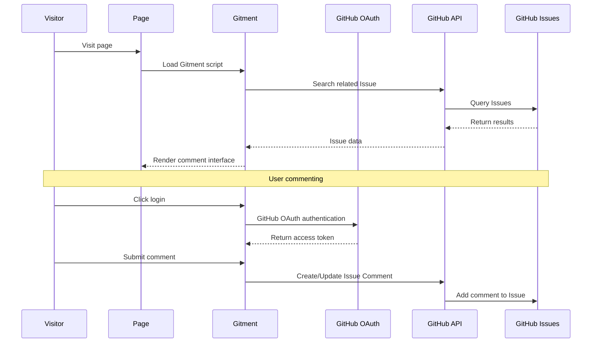

# Hexo Comments Gitment

[](https://www.npmjs.com/package/hexo-comments-gitment)
[](https://nodejs.org/en/download/)
[](https://hexo.io/)
[](https://github.com/huazie/diversity-plugins/blob/main/packages/hexo-comments-gitment/LICENSE)
[](https://github.com/huazie/diversity-plugins/stargazers)

Easily integrate the [Gitment](https://github.com/imsun/gitment) comment system into your Hexo blog, a lightweight comment solution based on GitHub Issues.

[中文说明/Chinese Documentation](README.md)

## Features

| Feature | Description | Advantages |
|------|------|------|
| **GitHub Integration** | Based on GitHub Issues, no database required | Zero maintenance cost, high availability |
| **OAuth Authentication** | Supports GitHub OAuth secure login | Protects user privacy, secure and reliable |
| **Theme Switching** | Supports light/dark theme auto-switching | Perfectly adapts to various theme styles |
| **Responsive Design** | Adapts to various device screens | Mobile-friendly user experience |
| **Markdown Support** | Supports Markdown/GFM syntax | Code highlighting, rich formatting |
| **Easy Configuration** | Simple YAML configuration | Quick setup, flexible customization |

## Quick Start

### Installation

```bash
# 1. Install multi-comment system core plugin (required)
npm install hexo-generator-comments --save

# 2. Install Gitment comment plugin
npm install hexo-comments-gitment --save
```

> **Note**: `hexo-comments-gitment` needs to be used with `hexo-generator-comments`
> More info: [hexo-generator-comments](https://github.com/huazie/diversity-plugins/tree/main/packages/hexo-generator-comments)

## Configuration Guide

### Basic Configuration

Add the following content to your Hexo site configuration `_config.yml` or theme configuration `_config.yml`, `_config.[theme].yml`:

```yaml
gitment:
  # Enable Gitment comment system
  enable: false
  # Enable loading indicator (shows loading animation while comments are loading)
  loading: true
  # GitHub repository owner
  owner: your-github-id
  # GitHub repository name for storing comments
  repo: your-repo-name
  # GitHub Application Client ID
  client_id: your-client-id
  # GitHub Application Client Secret
  client_secret: your-client-secret
  # Specifies the GitHub Issue matching rule, this will replace the id attribute when configured
  # pathname | url | title are used to match issue labels, `custom string` is a custom page unique identifier
  issue_term: pathname
  # Page unique identifier (optional, default to window.location.href)
  id: 
  # Page title (optional, default to document.title)
  title: 
  # Page link (optional, default to window.location.href)
  link: 
  # Page description (optional)
  desc: 
  # Issue labels (optional)
  labels: []
  # Number of comments per page (optional, default 20)
  per_page: 20
  # Max height of comments (px), over which comments will be folded (optional, default 250)
  max_comment_height: 250
  # OAuth proxy URL (optional), the default proxy gh-oauth.imsun.net is no longer available, deploy your own
  proxy:
```

> **Important**: Replace the placeholders in the configuration with your actual GitHub application information

### Configuration Options Details

| Option | Type | Default | Required | Description |
|------|------|--------|------|------|
| `enable` | Boolean | `false` | Yes | Enable Gitment comment system |
| `loading` | Boolean | `true` | No | Enable loading indicator (shows loading animation while comments are loading) |
| `owner` | String | - | Yes | GitHub repository owner's username |
| `repo` | String | - | Yes | GitHub repository name for storing comments |
| `client_id` | String | - | Yes | GitHub Application Client ID |
| `client_secret` | String | - | Yes | GitHub Application Client Secret |
| `issue_term` | String | `pathname` | No | Issue matching rule, see below for options |
| `id` | String | `window.location.href` | No | Page unique identifier for distinguishing comments across pages |
| `title` | String | `document.title` | No | Page title, used as issue's title |
| `link` | String | `window.location.href` | No | Page link, used in issue's body |
| `desc` | String | `''` | No | Page description, used in issue's body |
| `labels` | Array | `[]` | No | An array of labels to add when creating the issue |
| `per_page` | Number | `20` | No | Number of comments per page |
| `max_comment_height` | Number | `250` | No | Max height of comments (px), over which comments will be folded |
| `proxy` | String | - | No | OAuth proxy URL, for resolving authentication issues |

### Advanced Configuration Options

**issue_term Mapping Methods**

| Value | Description | Use Cases |
|---|------|----------|
| `pathname` | Use page path as page unique identifier | **Recommended**, suitable for most scenarios |
| `url` | Use full page URL as page unique identifier | When domain information is needed |
| `title` | Use page title as page unique identifier | When you want more friendly issue titles |
| `[custom string]` | Specify a custom unique identifier | Manual comment management |

**proxy Explanation**

Since Gitment's default OAuth proxy `gh-oauth.imsun.net` is no longer available, users will encounter `ERR_SSL_PROTOCOL_ERROR` when logging in. You need to deploy your own OAuth proxy service. Common solutions:

- **Vercel Serverless** — Deploy a simple proxy function
- **Cloudflare Workers** — Use Workers to forward requests
- **Self-hosted Server** — Deploy a Node.js proxy server

Once deployed, configure the proxy address:

```yaml
gitment:
  proxy: https://your-proxy-server.com
```

### Supported Template Engines

This plugin supports all Hexo themes using the following template engines:

| Template Engine | File Extension | Support Status |
|-----------------|----------------|----------------|
| **EJS** | `.ejs` | ✅ Fully Supported |
| **Nunjucks** | `.njk` | ✅ Fully Supported |
| **JSX + Inferno** | `.jsx` | ✅ Fully Supported |

## Prerequisites

Before getting started, please ensure the following requirements are met:

### 1. GitHub Repository Preparation
- Have a **public** GitHub repository
- Issues feature is enabled for the repository

### 2. Create GitHub OAuth Application
- Visit [GitHub OAuth App Settings](https://github.com/settings/applications/new)
- Create a new OAuth application
- Obtain Client ID and Client Secret

> **Note**: The Authorization callback URL of the OAuth application can be set to your blog domain

### 3. Deploy OAuth Proxy (Important)

Gitment's default OAuth proxy `gh-oauth.imsun.net` is no longer available, causing `ERR_SSL_PROTOCOL_ERROR` on login.

You need to deploy your own OAuth proxy. Here's a simple Vercel Serverless function example (copy the deployment URL to `proxy`):

```js
// api/oauth.js
module.exports = (req, res) => {
    const https = require('https');
    const data = JSON.stringify(req.body);
    const options = {
        hostname: 'github.com',
        path: '/login/oauth/access_token',
        method: 'POST',
        headers: {
            'Content-Type': 'application/json',
            'Accept': 'application/json',
            'Content-Length': data.length
        }
    };
    const proxyReq = https.request(options, proxyRes => {
        let body = '';
        proxyRes.on('data', chunk => body += chunk);
        proxyRes.on('end', () => {
            res.setHeader('Access-Control-Allow-Origin', '*');
            res.setHeader('Access-Control-Allow-Headers', 'Content-Type');
            res.status(200).json(JSON.parse(body));
        });
    });
    proxyReq.write(data);
    proxyReq.end();
};
```

Then configure:

```yaml
gitment:
  proxy: https://your-vercel-app.vercel.app/api/oauth
```

### 4. Initialize Comments
After the page is published, visit your page, log in with your GitHub account (make sure you're the repo's owner), and click the **Initialize** button to create the corresponding issue. After that, others can leave their comments.

## How It Works



### Detailed Process

1. **Page Loading**: Visitor opens the page, Gitment script starts working
2. **Search Issue**: Search for related issues in the specified repository based on configured `issue_term`
3. **Display Comments**: If corresponding issue is found, display comments from it
4. **OAuth Authentication**: Visitors need to log in via GitHub OAuth to comment
5. **Initialize Issue**: Repository owner needs to click the **Initialize** button on first visit to create the issue

## System Requirements

| Dependency | Version Requirement | Description |
|------|----------|------|
| **Node.js** | >= 14.0.0 | JavaScript runtime environment |
| **Hexo** | >= 5.3.0 | Static site generator |
| **GitHub Repository** | Public repository | Stores comment data |

## Related Links

### Official Resources
- [Gitment Official Documentation](https://github.com/imsun/gitment)
- [GitHub OAuth App Settings](https://github.com/settings/applications/new)
- [GitHub Issues Documentation](https://docs.github.com/en/issues)

### Hexo Documentation
- [Hexo Official Documentation](https://hexo.io/docs/)
- [Hexo Configuration Documentation](https://hexo.io/docs/configuration)
- [Hexo Plugin Development Documentation](https://hexo.io/docs/plugins)

### Related Plugins
- [hexo-generator-comments](https://github.com/huazie/diversity-plugins/tree/main/packages/hexo-generator-comments) - Multi-comment system core plugin
- [hexo-comments-utterances](https://github.com/huazie/diversity-plugins/tree/main/packages/hexo-comments-utterances) - Utterances comment plugin
- [hexo-comments-gitalk](https://github.com/huazie/diversity-plugins/tree/main/packages/hexo-comments-gitalk) - Gitalk comment plugin
- [hexo-comments-giscus](https://github.com/huazie/diversity-plugins/tree/main/packages/hexo-comments-giscus) - Giscus comment plugin
- [hexo-comments-twikoo](https://github.com/huazie/diversity-plugins/tree/main/packages/hexo-comments-twikoo) - Twikoo comment plugin

## License

This project is open source under the [MIT](LICENSE) license.
