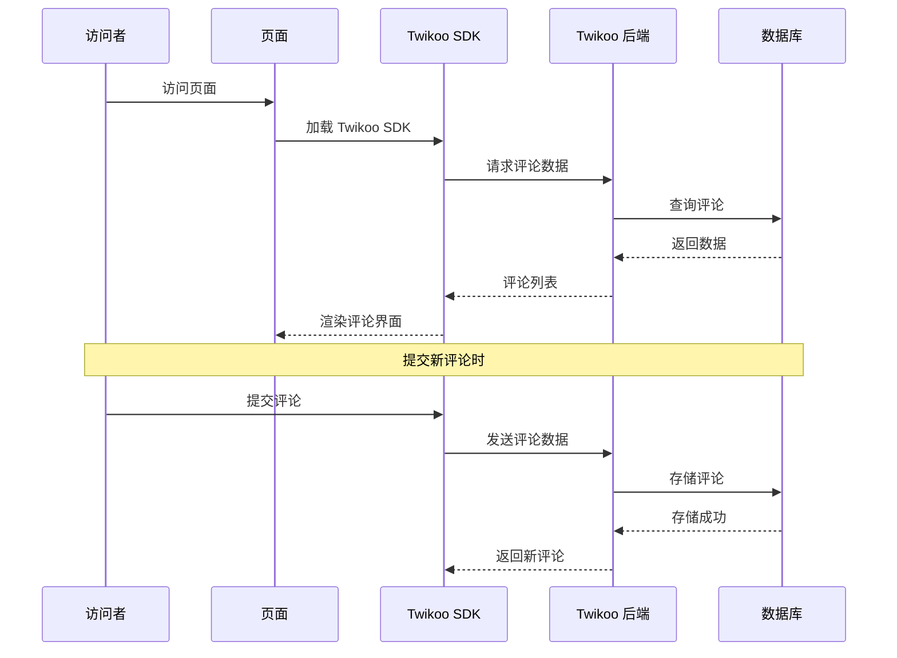

# Hexo Comments Twikoo

[](https://www.npmjs.com/package/hexo-comments-twikoo)
[](https://nodejs.org/en/download/)
[](https://hexo.io/)
[](https://github.com/huazie/diversity-plugins/blob/main/packages/hexo-comments-twikoo/LICENSE)
[](https://github.com/huazie/diversity-plugins/stargazers)

轻松集成 [Twikoo](https://twikoo.js.org/) 评论系统到您的 Hexo 博客中，一个简洁、安全、免费的静态网站评论系统。

[英文说明/English Documentation](README_EN.md)

## 功能特性

| 特性 | 描述 | 优势 |
|------|------|------|
| **免费私有部署** | 支持腾讯云 CloudBase、Vercel、Netlify 等多种部署方式 | 数据自主可控，零成本运行 |
| **安全可靠** | 完全开源，无广告无追踪 | 保护用户隐私，透明可信 |
| **暗黑模式** | 自动适配系统颜色方案 | 完美融入各种主题风格 |
| **响应式设计** | 适配各种设备屏幕 | 移动端友好的用户体验 |
| **即时加载** | 支持懒加载和加载动画 | 优化页面性能 |
| **易于配置** | 简单的 YAML 配置 | 快速上手，灵活定制 |
| **多语言支持** | 内置多语言界面 | 国际化用户体验 |

## 快速开始

### 安装插件

```bash
# 1. 安装多评论系统核心插件（必需）
npm install hexo-generator-comments --save

# 2. 安装 Twikoo 评论插件
npm install hexo-comments-twikoo --save
```

> **提示**：`hexo-comments-twikoo` 需要与 `hexo-generator-comments` 搭配使用
> 更多信息：[hexo-generator-comments](https://github.com/huazie/diversity-plugins/tree/main/packages/hexo-generator-comments)

## 配置指南

### 基本配置

在 Hexo 站点配置 `_config.yml` 或 主题配置 `_config.yml` 、`_config.[theme].yml` 中添加以下内容：

```yaml
twikoo:
  # 是否启用 Twikoo 评论系统，可选值：true 【启用】 | false 【禁用】
  enable: false
  # 是否启用加载提示，可选值：true | false
  loading: true
  # Twikoo 环境 ID (envId)，必填项
  env_id: your-env-id
  # 环境地域，默认为 ap-shanghai，腾讯云环境填 ap-shanghai 或 ap-guangzhou；Vercel 环境不填
  region:
  # 页面路径，用于区分不同页面的评论，默认使用 window.location.pathname
  path:
  # 用于手动设定评论区语言，支持的语言列表 https://github.com/twikoojs/twikoo/blob/main/src/client/utils/i18n/index.js
  lang: zh-CN
  # Twikoo JS SDK CDN 地址
  js: https://cdn.jsdelivr.net/npm/twikoo@1.7.9/dist/twikoo.min.js
```

> **重要**：请将 `your-env-id` 替换为您实际的 Twikoo 环境 ID

### 配置选项详解

| 选项 | 类型 | 默认值 | 必填 | 描述 |
|------|------|--------|------|------|
| `enable` | Boolean | `false` | 是 | 是否启用 Twikoo 评论系统 |
| `loading` | Boolean | `true` | 否 | 是否启用加载提示（评论加载时显示加载动画） |
| `env_id` | String | - | 是 | Twikoo 环境 ID，在部署后台系统中获取 |
| `region` | String | `ap-shanghai` | 否 | 环境地域，腾讯云环境填 `ap-shanghai` 或 `ap-guangzhou`；Vercel 环境不填 |
| `path` | String | - | 否 | 页面路径，用于区分不同页面的评论，默认使用 `window.location.pathname` |
| `lang` | String | `zh-CN` | 否 | 评论区语言，支持的语言列表见 [i18n](https://github.com/twikoojs/twikoo/blob/main/src/client/utils/i18n/index.js) |
| `js` | String | CDN 地址 | 否 | Twikoo JS SDK 的 CDN 地址，可指定特定版本或自部署地址 |

### 环境地域 (region) 说明

| 部署环境 | region 配置 | 说明 |
|----------|------------|------|
| 腾讯云 CloudBase | `ap-shanghai`（默认） | 国内访问推荐 |
| 腾讯云 CloudBase | `ap-guangzhou` | 广州地域 |
| Vercel | 留空或不填 | 国际访问推荐 |

### 支持的模板引擎

本插件支持所有使用以下模板引擎的 Hexo 主题：

| 模板引擎 | 文件扩展名 | 支持状态 |
|----------|------------|----------|
| **EJS** | `.ejs` | ✅ 完全支持 |
| **Nunjucks** | `.njk` | ✅ 完全支持 |
| **JSX + Inferno** | `.jsx` | ✅ 完全支持 |

## 使用前提

在开始使用之前，请确保满足以下条件：

### 1. 部署 Twikoo 后端

Twikoo 是一款需要后端服务的评论系统，您需要先部署 Twikoo 服务端。

**部署方式：**

| 平台 | 特点 | 适用场景 |
|------|------|----------|
| **腾讯云 CloudBase** | 国内访问快，有免费额度 | 面向国内用户的博客 |
| **Netlify + MongoDB** | 全球 CDN 加速 | 面向国际用户的博客 |
| **Vercel + MongoDB** | 全球 CDN 加速 | 面向国际用户的博客 |
| **Docker** | 自建服务器部署 | 需要完全掌控数据的场景 |
| **Railway** | 一键部署 | 快速上手体验 |

> **提示**：详细的部署教程请参考 [Twikoo 官方文档](https://twikoo.js.org/quick-start.html)

### 2. 获取环境 ID (envId)

部署完成后，在 Twikoo 管理后台获取您的环境 ID，填入配置文件中的 `env_id` 字段。

## 工作原理



### 详细流程

1. **页面加载**：访问者打开页面，Twikoo SDK 开始加载
2. **初始化连接**：SDK 通过 `envId` 连接到 Twikoo 后端服务
3. **加载评论**：根据页面 `path` 获取对应的评论数据
4. **渲染界面**：将评论列表展示在页面上
5. **提交评论**：访问者填写昵称、邮箱等信息后即可发表评论
6. **实时更新**：新评论实时写入数据库并展示

## 常见问题

### Q: 如何切换 Twikoo SDK 版本？

在配置中修改 `js` 字段，例如：

```yaml
twikoo:
  js: https://cdn.jsdelivr.net/npm/twikoo@1.7.9/dist/twikoo.min.js
```

### Q: Vercel 部署如何配置？

```yaml
twikoo:
  env_id: https://your-app.vercel.app
  region:    # 留空
```

### Q: 如何自定义页面评论路径？

```yaml
twikoo:
  path: /custom/path/to/page
```

## 相关链接

### 官方资源
- [Twikoo 官网](https://twikoo.js.org/)
- [Twikoo GitHub](https://github.com/twikoojs/twikoo)
- [Twikoo 快速上手](https://twikoo.js.org/quick-start.html)

### Hexo 文档
- [Hexo 官方文档](https://hexo.io/zh-cn/docs/)
- [Hexo 配置文档](https://hexo.io/zh-cn/docs/configuration)
- [Hexo 插件开发文档](https://hexo.io/zh-cn/docs/plugins)

### 相关插件
- [hexo-generator-comments](https://github.com/huazie/diversity-plugins/tree/main/packages/hexo-generator-comments) - 多评论系统核心插件
- [hexo-comments-gitalk](https://github.com/huazie/diversity-plugins/tree/main/packages/hexo-comments-gitalk) - Gitalk 评论插件
- [hexo-comments-giscus](https://github.com/huazie/diversity-plugins/tree/main/packages/hexo-comments-giscus) - Giscus 评论插件
- [hexo-comments-utterances](https://github.com/huazie/diversity-plugins/tree/main/packages/hexo-comments-utterances) - Utterances 评论插件

## 许可证

本项目基于 [MIT](LICENSE) 许可证开源。
