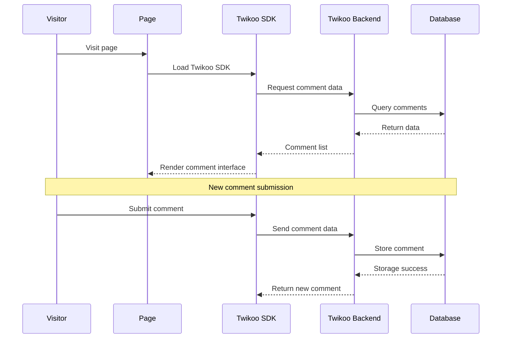

# Hexo Comments Twikoo

[](https://www.npmjs.com/package/hexo-comments-twikoo)
[](https://nodejs.org/en/download/)
[](https://hexo.io/)
[](https://github.com/huazie/diversity-plugins/blob/main/packages/hexo-comments-twikoo/LICENSE)
[](https://github.com/huazie/diversity-plugins/stargazers)

Easily integrate the [Twikoo](https://twikoo.js.org/) comment system into your Hexo blog, a simple, secure, and free static site comment system.

[中文说明/Chinese Documentation](README.md)

## Features

| Feature | Description | Advantages |
|------|------|------|
| **Free Self-Hosting** | Supports Tencent CloudBase, Vercel, Netlify and more deployment options | Full data control, zero cost operation |
| **Secure & Reliable** | Fully open source, no ads or tracking | Protects user privacy, transparent and trustworthy |
| **Dark Mode** | Auto-adapts to system color scheme | Seamlessly integrates with any theme style |
| **Responsive Design** | Adapts to various device screens | Mobile-friendly user experience |
| **Instant Loading** | Supports lazy loading and loading animations | Optimizes page performance |
| **Easy Configuration** | Simple YAML configuration | Quick setup, flexible customization |
| **Multi-language** | Built-in multi-language interface | International user experience |

## Quick Start

### Installation

```bash
# 1. Install multi-comment system core plugin (required)
npm install hexo-generator-comments --save

# 2. Install Twikoo comment plugin
npm install hexo-comments-twikoo --save
```

> **Note**: `hexo-comments-twikoo` needs to be used with `hexo-generator-comments`
> More info: [hexo-generator-comments](https://github.com/huazie/diversity-plugins/tree/main/packages/hexo-generator-comments)

## Configuration Guide

### Basic Configuration

Add the following content to your Hexo site configuration `_config.yml` or theme configuration `_config.yml`, `_config.[theme].yml`:

```yaml
twikoo:
  # Enable Twikoo comment system，Available values: true | false
  enable: false
  # Enable loading indicator, Available values: true | false
  loading: true
  # Twikoo environment ID (envId), required
  env_id: your-env-id
  # Environment region
  region: ap-shanghai
  # Page path to distinguish comments on different pages, defaults to `window.location.pathname`
  path:
  # Comment area language
  lang: zh-CN
  # Twikoo JS SDK CDN URL
  js: https://cdn.jsdelivr.net/npm/twikoo@1.7.9/dist/twikoo.min.js
```

> **Important**: Replace `your-env-id` with your actual Twikoo environment ID

### Configuration Options Details

| Option | Type | Default | Required | Description |
|------|------|--------|------|------|
| `enable` | Boolean | `false` | Yes | Enable Twikoo comment system |
| `loading` | Boolean | `true` | No | Enable loading indicator (shows loading animation while comments are loading) |
| `env_id` | String | - | Yes | Twikoo environment ID, obtained from the backend management console |
| `region` | String | `ap-shanghai` | No | Environment region. For Tencent CloudBase: `ap-shanghai` or `ap-guangzhou`; For Vercel: leave empty |
| `path` | String | - | No | Page path to distinguish comments on different pages, defaults to `window.location.pathname` |
| `lang` | String | `zh-CN` | No | Comment area language, supported languages see [i18n](https://github.com/twikoojs/twikoo/blob/main/src/client/utils/i18n/index.js) |
| `js` | String | CDN URL | No | Twikoo JS SDK CDN URL, can specify a specific version or self-hosted address |

### Region Configuration

| Deployment Platform | region Config | Description |
|----------|------------|------|
| Tencent CloudBase | `ap-shanghai` (default) | Recommended for users in China |
| Tencent CloudBase | `ap-guangzhou` | Guangzhou region |
| Vercel | Leave empty | Recommended for international access |

### Supported Template Engines

This plugin supports all Hexo themes using the following template engines:

| Template Engine | File Extension | Support Status |
|-----------------|----------------|----------------|
| **EJS** | `.ejs` | ✅ Fully Supported |
| **Nunjucks** | `.njk` | ✅ Fully Supported |
| **JSX + Inferno** | `.jsx` | ✅ Fully Supported |

## Prerequisites

Before getting started, please ensure the following requirements are met:

### 1. Deploy Twikoo Backend

Twikoo is a comment system that requires a backend service. You need to deploy the Twikoo server first.

**Deployment Options:**

| Platform | Features | Use Cases |
|------|------|----------|
| **Tencent CloudBase** | Fast access in China, free tier available | Blogs targeting Chinese users |
| **Vercel + MongoDB** | Global CDN acceleration | Blogs targeting international users |
| **Docker** | Self-hosted server deployment | Full data control scenarios |
| **Railway** | One-click deployment | Quick start experience |

> **Note**: For detailed deployment tutorials, please refer to the [Twikoo Official Documentation](https://twikoo.js.org/quick-start.html)

### 2. Get Environment ID (envId)

After deployment, obtain your environment ID from the Twikoo management console and fill it into the `env_id` field in the configuration.

## How It Works



### Detailed Process

1. **Page Loading**: Visitor opens the page, Twikoo SDK starts loading
2. **Initialize Connection**: SDK connects to Twikoo backend service via `envId`
3. **Load Comments**: Retrieve comment data based on page `path`
4. **Render Interface**: Display comment list on the page
5. **Submit Comment**: Visitors can comment after filling in nickname, email, and other information
6. **Real-time Update**: New comments are written to the database and displayed in real-time

## FAQ

### Q: How to switch Twikoo SDK version?

Modify the `js` field in the configuration, for example:

```yaml
twikoo:
  js: https://cdn.jsdelivr.net/npm/twikoo@1.7.9/dist/twikoo.min.js
```

### Q: How to configure for Vercel deployment?

```yaml
twikoo:
  env_id: https://your-app.vercel.app
  region:    # Leave empty
```

### Q: How to customize page comment path?

```yaml
twikoo:
  path: /custom/path/to/page
```

## Related Links

### Official Resources
- [Twikoo Official Website](https://twikoo.js.org/)
- [Twikoo GitHub](https://github.com/twikoojs/twikoo)
- [Twikoo Quick Start](https://twikoo.js.org/quick-start.html)

### Hexo Documentation
- [Hexo Official Documentation](https://hexo.io/docs/)
- [Hexo Configuration Documentation](https://hexo.io/docs/configuration)
- [Hexo Plugin Development Documentation](https://hexo.io/docs/plugins)

### Related Plugins
- [hexo-generator-comments](https://github.com/huazie/diversity-plugins/tree/main/packages/hexo-generator-comments) - Multi-comment system core plugin
- [hexo-comments-gitalk](https://github.com/huazie/diversity-plugins/tree/main/packages/hexo-comments-gitalk) - Gitalk comment plugin
- [hexo-comments-giscus](https://github.com/huazie/diversity-plugins/tree/main/packages/hexo-comments-giscus) - Giscus comment plugin
- [hexo-comments-utterances](https://github.com/huazie/diversity-plugins/tree/main/packages/hexo-comments-utterances) - Utterances comment plugin

## License

This project is open source under the [MIT](LICENSE) license.
