# Hexo Comments Utterances

[](https://www.npmjs.com/package/hexo-comments-utterances)
[](https://nodejs.org/en/download/)
[](https://hexo.io/)
[](https://github.com/huazie/diversity-plugins/blob/main/packages/hexo-comments-utterances/LICENSE)
[](https://github.com/huazie/diversity-plugins/stargazers)

轻松集成 [Utterances](https://utteranc.es/) 评论系统到您的 Hexo 博客中，基于 GitHub Issues 的轻量级评论解决方案。

## 功能特性

| 特性 | 描述 | 优势 |
|------|------|------|
| **轻量级** | 基于 GitHub Issues，无需数据库 | 零维护成本，高可用性 |
| **安全可靠** | 完全开源，无广告无追踪 | 保护用户隐私，透明可信 |
| **主题切换** | 支持亮色/暗色主题自动切换 | 完美适配各种主题风格 |
| **响应式设计** | 适配各种设备屏幕 | 移动端友好的用户体验 |
| **即时加载** | 支持懒加载和加载动画 | 优化页面性能 |
| **易于配置** | 简单的 YAML 配置 | 快速上手，灵活定制 |

## 快速开始

### 安装插件

```bash
# 1. 安装多评论系统核心插件（必需）
npm install hexo-generator-comments --save

# 2. 安装 Utterances 评论插件
npm install hexo-comments-utterances --save
```

> **提示**：`hexo-comments-utterances` 需要与 `hexo-generator-comments` 搭配使用
> 更多信息：[hexo-generator-comments](https://github.com/huazie/diversity-plugins/tree/main/packages/hexo-generator-comments)

## 配置指南

### 基本配置

在 Hexo 站点根目录的 `_config.yml` 文件中添加以下配置：

```yaml
utterances:
  # 是否启用 Utterances 评论系统
  enable: true
  # 是否显示加载动画
  loading: true
  # GitHub 仓库，格式为 username/repo-name
  repo: your-username/your-repo-name
  # 用于映射评论到 issue 的方式
  issue_term: pathname
  # 亮色主题
  theme: github-light
  # 暗色主题
  dark: github-dark
```

> **重要**：请将 `your-username/your-repo-name` 替换为您的实际 GitHub 仓库地址

### 配置选项详解

| 选项 | 类型 | 默认值 | 必填 | 描述 |
|------|------|--------|------|------|
| `enable` | Boolean | `false` | 否 | 是否启用 Utterances 评论系统 |
| `loading` | Boolean | `true` | 否 | 是否显示评论加载动画 |
| `repo` | String | - | 是 | GitHub 仓库，格式：`username/repo-name` |
| `issue_term` | String | `pathname` | 否 | 映射评论到 issue 的方式 |
| `theme` | String | `github-light` | 否 | 亮色模式主题 |
| `dark` | String | `github-dark` | 否 | 暗色模式主题 |

### 高级配置选项

**issue_term 映射方式**

| 值 | 描述 | 适用场景 |
|---|------|----------|
| `pathname` | 使用页面路径作为 issue 标题 | **推荐**，适合大多数场景 |
| `url` | 使用页面完整 URL 作为 issue 标题 | 需要包含域名信息时 |
| `title` | 使用页面标题作为 issue 标题 | 希望 issue 标题更友好 |
| `og:title` | 使用页面 Open Graph 标题 | SEO 优化场景 |
| `[issue-number]` | 指定特定的 issue 编号 | 手动管理评论 |
| `[specific-term]` | 使用特定术语作为标题 | 自定义标识符 |

**主题样式选项**

| 主题名 | 特点 |
|--------|------|
| `github-light` | GitHub 官方亮色主题 |
| `boxy-light` | 盒子风格亮色主题 |
| `github-dark` | GitHub 官方暗色主题 |
| `github-dark-orange` | GitHub 暗橙色主题 |
| `icy-dark` | 冰蓝暗色主题 |
| `dark-blue` | 深蓝暗色主题 |
| `photon-dark` | 光子暗色主题 |
| `preferred-color-scheme` | 自动跟随系统主题 |

## 使用前提

在开始使用之前，请确保满足以下条件：

### 1. GitHub 仓库准备
- 拥有一个 **公开的** GitHub 仓库
- 仓库已启用 Issues 功能

### 2. 安装 Utterances App
- 访问 [Utterances GitHub App](https://github.com/apps/utterances)
- 点击 "Install" 并选择您的仓库
- 授权 Utterances 访问您的仓库

> **提示**：Utterances App 只需要 Issues 的读写权限，非常安全

## 工作原理

```mermaid
sequenceDiagram
    participant V as 访问者
    participant P as 页面
    participant U as Utterances
    participant G as GitHub API
    participant I as GitHub Issues

    V->>P: 访问页面
    P->>U: 加载 Utterances 脚本
    U->>G: 搜索相关 Issue
    G->>I: 查询 Issues
    I-->>G: 返回结果
    G-->>U: Issue 数据
    U-->>P: 渲染评论界面
    
    Note over V,I: 首次评论时
    V->>U: 提交评论
    U->>G: 创建/更新 Issue
    G->>I: 创建新 Issue
```



### 详细流程

1. **页面加载**：访问者打开页面，Utterances 脚本开始工作
2. **搜索 Issue**：根据配置的 `issue_term` 在指定仓库中搜索相关 Issue
3. **显示评论**：如果找到对应 Issue，显示其中的评论
4. **创建 Issue**：首次评论时，自动创建新的 Issue
5. **GitHub 登录**：访问者需要 GitHub 账号才能参与评论

## 系统要求

| 依赖 | 版本要求 | 说明 |
|------|----------|------|
| **Node.js** | >= 14.0.0 | JavaScript 运行环境 |
| **Hexo** | >= 5.3.0 | 静态站点生成器 |
| **GitHub 仓库** | 公开仓库 | 存储评论数据 |

## 相关链接

### 官方资源
- [Utterances 官网](https://utteranc.es/)
- [Utterances GitHub App](https://github.com/apps/utterances)
- [GitHub OAuth 应用设置](https://github.com/settings/applications/new)

### Hexo 文档
- [Hexo 官方文档](https://hexo.io/zh-cn/docs/)
- [Hexo 配置文档](https://hexo.io/zh-cn/docs/configuration)
- [Hexo 插件开发文档](https://hexo.io/zh-cn/docs/plugins)

### 相关插件
- [hexo-generator-comments](https://github.com/huazie/diversity-plugins/tree/main/packages/hexo-generator-comments) - 多评论系统核心插件
- [hexo-comments-gitalk](https://github.com/huazie/diversity-plugins/tree/main/packages/hexo-comments-gitalk) - Gitalk 评论插件
- [hexo-comments-giscus](https://github.com/huazie/diversity-plugins/tree/main/packages/hexo-comments-giscus) - Giscus 评论插件

## 📄 许可证

本项目基于 [MIT](LICENSE) 许可证开源。