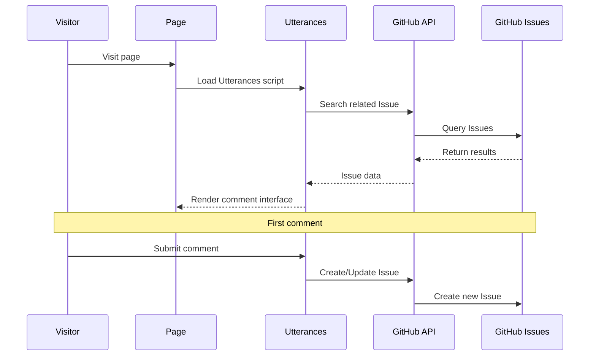

# Hexo Comments Utterances

[](https://www.npmjs.com/package/hexo-comments-utterances)
[](https://nodejs.org/en/download/)
[](https://hexo.io/)
[](https://github.com/huazie/diversity-plugins/blob/main/packages/hexo-comments-utterances/LICENSE)
[](https://github.com/huazie/diversity-plugins/stargazers)

Easily integrate the [Utterances](https://utteranc.es/) comment system into your Hexo blog, a lightweight comment solution based on GitHub Issues.

[中文说明/Chinese Documentation](README.md)

## Features

| Feature | Description | Advantages |
|------|------|------|
| **Lightweight** | Based on GitHub Issues, no database required | Zero maintenance cost, high availability |
| **Secure & Reliable** | Fully open source, no ads or tracking | Protects user privacy, transparent and trustworthy |
| **Theme Switching** | Supports light/dark theme auto-switching | Perfectly adapts to various theme styles |
| **Responsive Design** | Adapts to various device screens | Mobile-friendly user experience |
| **Instant Loading** | Supports lazy loading and loading animations | Optimizes page performance |
| **Easy Configuration** | Simple YAML configuration | Quick setup, flexible customization |

## Quick Start

### Installation

```bash
# 1. Install multi-comment system core plugin (required)
npm install hexo-generator-comments --save

# 2. Install Utterances comment plugin
npm install hexo-comments-utterances --save
```

> **Note**: `hexo-comments-utterances` needs to be used with `hexo-generator-comments`
> More info: [hexo-generator-comments](https://github.com/huazie/diversity-plugins/tree/main/packages/hexo-generator-comments)

## Configuration Guide

### Basic Configuration

Add the following content to your Hexo site configuration `_config.yml` or theme configuration `_config.yml`, `_config.[theme].yml`:

```yaml
utterances:
  # Enable Utterances comment system
  enable: false
  # Enable loading prompt, optional values: `true` | `false`
  loading: true
  # GitHub repository owner and name, format: username/repo-name
  repo: your-username/your-repo-name
  # Specify issue mapping rule
  issue_term: pathname
  # Light theme
  theme: github-light
  # Dark theme
  dark: github-dark
```

> **Important**: Replace `your-username/your-repo-name` with your actual GitHub repository address

### Configuration Options Details

| Option | Type | Default | Required | Description |
|------|------|--------|------|------|
| `enable` | Boolean | `false` | Yes | Enable Utterances comment system |
| `loading` | Boolean | `true` | Yes | Show comment loading animation |
| `repo` | String | - | Yes | GitHub repository, format: `username/repo-name` |
| `issue_term` | String | `pathname` | Yes | How to map comments to issues |
| `theme` | String | `github-light` | Yes | Light mode theme |
| `dark` | String | `github-dark` | Yes | Dark mode theme |

### Advanced Configuration Options

**issue_term Mapping Methods**

| Value | Description | Use Cases |
|---|------|----------|
| `pathname` | Use page path as issue title | **Recommended**, suitable for most scenarios |
| `url` | Use full page URL as issue title | When domain information is needed |
| `title` | Use page title as issue title | When you want more friendly issue titles |
| `og:title` | Use page Open Graph title | SEO optimization scenarios |
| `[issue-number]` | Specify specific issue number | Manual comment management |
| `[specific-term]` | Use specific term as title | Custom identifiers |

**Theme Style Options**

| Theme Name | Characteristics |
|--------|------|
| `github-light` | GitHub official light theme |
| `boxy-light` | Boxy style light theme |
| `github-dark` | GitHub official dark theme |
| `github-dark-orange` | GitHub dark orange theme |
| `icy-dark` | Icy blue dark theme |
| `dark-blue` | Dark blue theme |
| `photon-dark` | Photon dark theme |
| `preferred-color-scheme` | Auto-follow system theme |

### Supported Template Engines

This plugin supports all Hexo themes using the following template engines:

| Template Engine | File Extension | Support Status |
|-----------------|----------------|----------------|
| **EJS** | `.ejs` | ✅ Fully Supported |
| **Nunjucks** | `.njk` | ✅ Fully Supported |
| **JSX + Inferno** | `.jsx` | ✅ Fully Supported |

## Prerequisites

Before getting started, please ensure the following requirements are met:

### 1. GitHub Repository Preparation
- Have a **public** GitHub repository
- Issues feature is enabled for the repository

### 2. Install Utterances App
- Visit [Utterances GitHub App](https://github.com/apps/utterances)
- Click "Install" and select your repository
- Authorize Utterances to access your repository

> **Note**: Utterances App only requires read-write permissions for Issues, very secure

## How It Works



### Detailed Process

1. **Page Loading**: Visitor opens the page, Utterances script starts working
2. **Search Issue**: Search for related issues in the specified repository based on configured `issue_term`
3. **Display Comments**: If corresponding issue is found, display comments from it
4. **Create Issue**: When commenting for the first time, automatically create a new issue
5. **GitHub Login**: Visitors need a GitHub account to participate in comments

## Related Links

### Official Resources
- [Utterances Official Website](https://utteranc.es/)
- [Utterances GitHub App](https://github.com/apps/utterances)
- [GitHub OAuth App Settings](https://github.com/settings/applications/new)

### Hexo Documentation
- [Hexo Official Documentation](https://hexo.io/docs/)
- [Hexo Configuration Documentation](https://hexo.io/docs/configuration)
- [Hexo Plugin Development Documentation](https://hexo.io/docs/plugins)

### Related Plugins
- [hexo-generator-comments](https://github.com/huazie/diversity-plugins/tree/main/packages/hexo-generator-comments) - Multi-comment system core plugin
- [hexo-comments-gitalk](https://github.com/huazie/diversity-plugins/tree/main/packages/hexo-comments-gitalk) - Gitalk comment plugin
- [hexo-comments-giscus](https://github.com/huazie/diversity-plugins/tree/main/packages/hexo-comments-giscus) - Giscus comment plugin

## License

This project is open source under the [MIT](LICENSE) license.