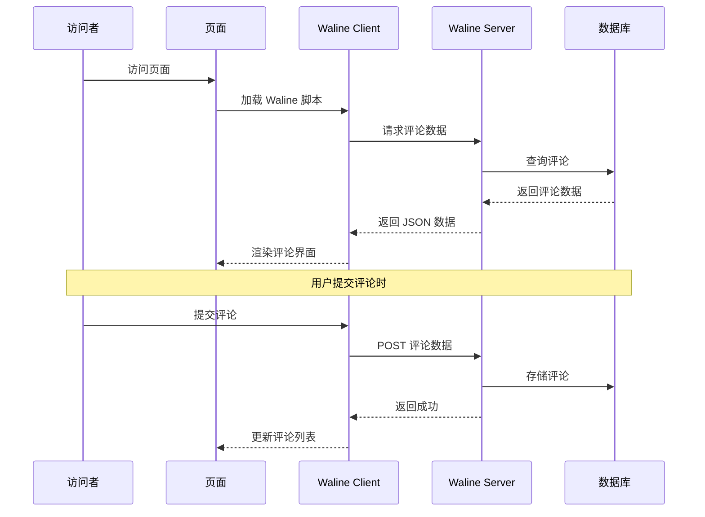

# Hexo Comments Waline

[](https://www.npmjs.com/package/hexo-comments-waline)
[](https://nodejs.org/en/download/)
[](https://hexo.io/)
[](https://github.com/huazie/diversity-plugins/blob/main/packages/hexo-comments-waline/LICENSE)
[](https://github.com/huazie/diversity-plugins/stargazers)

轻松集成 [Waline](https://waline.js.org/) 评论系统到您的 Hexo 博客中，简单但功能强大的评论解决方案。

[英文说明/English Documentation](README_EN.md)

## 功能特性

| 特性 | 描述 | 优势 |
|------|------|------|
| **轻量简洁** | 仅需 50kB 大小 | 快速加载，优化性能 |
| **多部署方式** | 支持 Vercel、Netlify、Docker、自建服务器 | 灵活选择，易于部署 |
| **安全可靠** | 完全开源，支持多种登录方式 | 保护用户隐私，透明可信 |
| **功能丰富** | 支持评论、阅读量、点赞、表情反应 | 一站式互动解决方案 |
| **主题切换** | 支持亮色/暗色主题自动切换 | 完美适配各种主题风格 |
| **多语言支持** | 内置 30+ 语言支持 | 国际化友好 |
| **易于配置** | 简单的 YAML 配置 | 快速上手，灵活定制 |

## 快速开始

### 安装插件

```bash
# 1. 安装多评论系统核心插件（必需）
npm install hexo-generator-comments --save

# 2. 安装 Waline 评论插件
npm install hexo-comments-waline --save
```

> **提示**：`hexo-comments-waline` 需要与 `hexo-generator-comments` 搭配使用
> 更多信息：[hexo-generator-comments](https://github.com/huazie/diversity-plugins/tree/main/packages/hexo-generator-comments)

## 配置指南

### 基本配置

在 Hexo 站点配置 `_config.yml` 或主题配置 `_config.yml` 、`_config.[theme].yml` 中添加以下内容：

```yaml
waline:
  # 是否启用 Waline 评论系统
  enable: false
  # 是否启用加载提示
  loading: true
  # Waline 服务端地址，必须配置
  server_url: https://your-waline-server.netlify.app/.netlify/functions/comment
  # Waline JS 文件 URL
  js_url: https://unpkg.com/@waline/client@v3/dist/waline.js
  # Waline CSS 文件 URL
  css_url: https://unpkg.com/@waline/client@v3/dist/waline.css
  # 当前文章的唯一标识，用于区分不同页面的评论。需保证唯一性。
  path: pathname
  # 评论区语言
  lang: zh-CN
  # 表情包设置，支持数组或 false 禁用
  emoji:
  # 暗黑模式适配
  dark: auto
  # 评论时需要填写的信息字段
  meta: ['nick', 'mail', 'link']
  # 必填的字段数组
  required_meta: []
  # 评论排序方式
  comment_sorting: latest
  # 登录配置
  login: enable
  # 评论字数限制
  word_limit: false
  # 每页评论条数
  page_size: 10
  # 表情包搜索功能
  search: false
  # 是否隐藏页脚版权信息
  no_copyright: false
  # 是否隐藏 RSS 订阅链接
  no_rss: false
  # 表情反应功能
  reaction: true
```

> **重要**：请将 `server_url` 配置替换为您的实际 Waline 服务端地址

### 配置选项详解

| 选项 | 类型 | 默认值 | 必填 | 描述 |
|------|------|--------|------|------|
| `enable` | Boolean | `false` | 是 | 是否启用 Waline 评论系统 |
| `loading` | Boolean | `true` | 否 | 是否启用加载提示（评论加载时显示加载动画） |
| `server_url` | String | - | 是 | Waline 服务端地址（Vercel/Docker/自建） |
| `js_url` | String | unpkg CDN | 否 | Waline JS 文件 URL |
| `css_url` | String | unpkg CDN | 否 | Waline CSS 文件 URL |
| `path` | String | `pathname` | 否 | 评论区路径，用于区分不同的页面 |
| `lang` | String | `zh-CN` | 否 | 评论区的语言（界面文本） |
| `emoji` | Array/Boolean | - | 否 | 表情包设置，支持数组或 false 禁用 |
| `dark` | String/Boolean | `auto` | 否 | 深色模式（`false`/`true`/`auto`/CSS选择器） |
| `meta` | Array | `['nick', 'mail', 'link']` | 否 | 用户信息字段 |
| `required_meta` | Array | `[]` | 否 | 必填的用户信息字段 |
| `comment_sorting` | String | `latest` | 否 | 评论排序方式（latest/oldest/hottest） |
| `login` | String | `enable` | 否 | 登录配置（enable/disable/force） |
| `word_limit` | Number/Array/Boolean | `false` | 否 | 评论字数限制（数字/[最小,最大]/false） |
| `page_size` | Number | `10` | 否 | 每页评论条数 |
| `search` | Boolean | `false` | 否 | 是否启用表情包搜索功能 |
| `no_copyright` | Boolean | `false` | 否 | 是否隐藏页脚版权信息 |
| `no_rss` | Boolean | `false` | 否 | 是否隐藏 RSS 订阅链接 |
| `reaction` | Boolean/Array | `true` | 否 | 表情反应功能（true/false/自定义数组） |

### 高级配置选项

**dark 深色模式选项**

| 值 | 描述 |
|-----|------|
| `false` | 禁用深色模式 |
| `true` | 启用深色模式 |
| `auto` | 自动跟随系统主题切换 |
| `'html[data-theme="dark"]'` | 自定义 CSS 选择器 |

**lang 语言选项**

Waline 内置支持 30+ 种语言，常用语言代码：

| 语言代码 | 语言名称 |
|----------|----------|
| `zh-CN` | 简体中文 |
| `zh-TW` | 繁体中文 |
| `en` | 英文 |
| `ja` | 日语 |
| `ko` | 韩语 |
| `ru` | 俄语 |
| `fr` | 法语 |
| `es` | 西班牙语 |
| ... | ... |

**login 登录配置选项**

| 值 | 描述 |
|-----|------|
| `enable` | 启用登录（用户可选择登录或匿名评论） |
| `disable` | 禁用登录（所有评论均为匿名） |
| `force` | 强制登录（用户必须登录才能评论） |

**reaction 表情反应功能**

启用评论表情反应功能，可以让读者对评论进行点赞、点踩等操作：

```yaml
# 启用表情反应（默认）
reaction: true

# 禁用表情反应
reaction: false

# 自定义反应表情（参考：https://waline.js.org/guide/features/reaction.html）
reaction:
  - https://example.com/reaction1.png
  - https://example.com/reaction2.png
```

**自定义表情包**

Waline 支持自定义表情包，配置示例：

```yaml
emoji:
  - https://unpkg.com/@waline/emojis/weibo
  - https://example.com/custom-emoji.json
```

表情包 JSON 格式参考：[Waline 表情包文档](https://waline.js.org/guide/features/emoji.html)

**评论字数限制**

```yaml
# 最大字数限制（自动转换为 [0, 500]）
word_limit: 500

# 最小和最大字数限制
word_limit: [10, 500]

# 禁用字数限制
word_limit: false
```

**每页评论条数**

```yaml
# 设置每页显示 15 条评论
page_size: 15
```

**表情包搜索功能**

```yaml
# 启用表情包搜索（默认）
search: true

# 禁用表情包搜索
search: false
```

### 支持的模板引擎

本插件支持所有使用以下模板引擎的 Hexo 主题：

| 模板引擎 | 文件扩展名 | 支持状态 |
|----------|------------|----------|
| **EJS** | `.ejs` | ✅ 完全支持 |
| **Nunjucks** | `.njk` | ✅ 完全支持 |
| **JSX + Inferno** | `.jsx` | ✅ 完全支持 |

## 使用前提

在开始使用之前，请确保已完成 Waline 服务端的部署：

### 方式一：使用 Vercel 部署（推荐）

1. 点击下方按钮一键部署到 Vercel：

   [](https://vercel.com/new/clone?repository-url=https://github.com/walinejs/waline/tree/main/example)

2. 部署完成后，复制 Vercel 分配的域名（格式：`https://your-project.vercel.app`）

3. 在配置中填写 `server_url: https://your-project.vercel.app`

> **详细文档**：[使用 Vercel 简单部署 Waline](https://waline.js.org/guide/get-started.html#使用-vercel-简单地部署-waline-评论系统)

### 方式二：使用 Netlify 部署

[使用 Netlify 部署 Waline](https://waline.js.org/guide/deploy/netlify.html)

### 方式N：其他方式部署

[使用其他方式部署 Waline](https://waline.js.org/guide/deploy/)

## 工作原理



### 详细流程

1. **页面加载**：访问者打开页面，Waline 客户端脚本开始工作
2. **请求数据**：客户端向 Waline 服务端请求评论数据
3. **渲染界面**：服务端从数据库读取评论，返回 JSON 数据，客户端渲染评论界面
4. **提交评论**：访问者提交评论，客户端 POST 到服务端
5. **存储评论**：服务端将评论存储到数据库，返回成功状态

## 从 Valine 迁移

如果您之前使用 Valine 评论系统，可以参考这篇文章进行迁移：

- [从 Valine 迁移到 Waline](https://lenciel.com/2026/03/valine-to-waline/)

## 系统要求

| 依赖 | 版本要求 | 说明 |
|------|----------|------|
| **Node.js** | >= 14.0.0 | JavaScript 运行环境 |
| **Hexo** | >= 5.3.0 | 静态站点生成器 |
| **Waline 服务端** | - | 需要部署 Waline 服务端 |

## 相关链接

### 官方资源
- [Waline 官网](https://waline.js.org/)
- [Waline GitHub](https://github.com/walinejs/waline)
- [Waline 配置文档](https://waline.js.org/reference/client.html)
- [Waline 服务端部署](https://waline.js.org/guide/server.html)

### Hexo 文档
- [Hexo 官方文档](https://hexo.io/zh-cn/docs/)
- [Hexo 配置文档](https://hexo.io/zh-cn/docs/configuration)
- [Hexo 插件开发文档](https://hexo.io/zh-cn/docs/plugins)

### 相关插件
- [hexo-generator-comments](https://github.com/huazie/diversity-plugins/tree/main/packages/hexo-generator-comments) - 多评论系统核心插件
- [hexo-comments-giscus](https://github.com/huazie/diversity-plugins/tree/main/packages/hexo-comments-giscus) - Giscus 评论插件
- [hexo-comments-gitalk](https://github.com/huazie/diversity-plugins/tree/main/packages/hexo-comments-gitalk) - Gitalk 评论插件
- [hexo-comments-gitment](https://github.com/huazie/diversity-plugins/tree/main/packages/hexo-comments-gitment) - Gitment 评论插件
- [hexo-comments-twikoo](https://github.com/huazie/diversity-plugins/tree/main/packages/hexo-comments-twikoo) - Twikoo 评论插件
- [hexo-comments-utterances](https://github.com/huazie/diversity-plugins/tree/main/packages/hexo-comments-utterances) - Utterances 评论插件

## 许可证

本项目基于 [MIT](LICENSE) 许可证开源。
