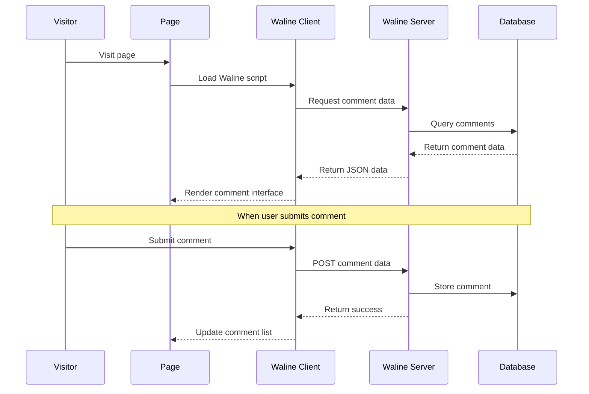

# Hexo Comments Waline

[](https://www.npmjs.com/package/hexo-comments-waline)
[](https://nodejs.org/en/download/)
[](https://hexo.io/)
[](https://github.com/huazie/diversity-plugins/blob/main/packages/hexo-comments-waline/LICENSE)
[](https://github.com/huazie/diversity-plugins/stargazers)

Easily integrate the [Waline](https://waline.js.org/) comment system into your Hexo blog, a simple but powerful comment solution.

[中文说明/Chinese Documentation](README.md)

## Features

| Feature | Description | Advantages |
|---------|------|----------|
| **Lightweight** | Only 50kB in size | Fast loading, optimized performance |
| **Multiple Deployment** | Supports Vercel, Netlify, Docker, self-hosted | Flexible choices, easy deployment |
| **Secure & Reliable** | Fully open source, multiple login methods | Protects user privacy, transparent and trustworthy |
| **Feature-rich** | Supports comments, pageviews, likes, emoji reactions | One-stop interactive solution |
| **Theme Switching** | Supports light/dark theme auto-switching | Perfectly adapts to various theme styles |
| **Multi-language Support** | Built-in 30+ language support | Internationalization friendly |
| **Easy Configuration** | Simple YAML configuration | Quick setup, flexible customization |

## Quick Start

### Installation

```bash
# 1. Install multi-comment system core plugin (required)
npm install hexo-generator-comments --save

# 2. Install Waline comment plugin
npm install hexo-comments-waline --save
```

> **Note**: `hexo-comments-waline` needs to be used with `hexo-generator-comments`
> More info: [hexo-generator-comments](https://github.com/huazie/diversity-plugins/tree/main/packages/hexo-generator-comments)

## Configuration Guide

### Basic Configuration

Add the following content to your Hexo site configuration `_config.yml` or theme configuration `_config.yml`, `_config.[theme].yml`:

```yaml
waline:
  # Enable Waline comment system
  enable: false
  # Enable loading indicator
  loading: true
  # Waline server URL (required)
  server_url: https://your-waline-server.netlify.app/.netlify/functions/comment
  # Waline JS file URL
  js_url: https://unpkg.com/@waline/client@v3/dist/waline.js
  # Waline CSS file URL
  css_url: https://unpkg.com/@waline/client@v3/dist/waline.css
  # Current article unique identifier
  path: pathname
  # Comment section language
  lang: zh-CN
  # Emoji pack settings
  emoji:
  # Dark mode adaptation
  dark: auto
  # User info fields required for commenting
  meta: ['nick', 'mail', 'link']
  # Required fields array
  required_meta: []
  # Comment sorting method
  comment_sorting: latest
  # Login configuration
  login: enable
  # Comment word limit
  word_limit: false
  # Comments per page
  page_size: 10
  # Emoji search function
  search: false
  # Hide footer copyright info
  no_copyright: false
  # Hide RSS subscription link
  no_rss: false
  # Emoji reaction feature
  reaction: true
```

> **Important**: Replace the `server_url` configuration with your actual Waline server URL

### Configuration Options Details

| Option | Type | Default | Required | Description |
|--------|------|---------|----------|-------------|
| `enable` | Boolean | `false` | Yes | Enable Waline comment system |
| `loading` | Boolean | `true` | No | Enable loading indicator (shows loading animation while comments are loading) |
| `server_url` | String | - | Yes | Waline server URL (Vercel/Docker/self-hosted) |
| `js_url` | String | unpkg CDN | No | Waline JS file URL |
| `css_url` | String | unpkg CDN | No | Waline CSS file URL |
| `path` | String | `pathname` | No | Comment path, used to distinguish different pages |
| `lang` | String | `zh-CN` | No | Comment section language (interface text) |
| `emoji` | Array/Boolean | - | No | Emoji pack settings, supports array or false to disable |
| `dark` | String/Boolean | `auto` | No | Dark mode (`false`/`true`/`auto`/CSS selector) |
| `meta` | Array | `['nick', 'mail', 'link']` | No | User info fields |
| `required_meta` | Array | `[]` | No | Required user info fields |
| `comment_sorting` | String | `latest` | No | Comment sorting method (latest/oldest/hottest) |
| `login` | String | `enable` | No | Login configuration (enable/disable/force) |
| `word_limit` | Number/Array/Boolean | `false` | No | Comment word limit (number/[min,max]/false) |
| `page_size` | Number | `10` | No | Comments per page |
| `search` | Boolean | `false` | No | Enable emoji search function |
| `no_copyright` | Boolean | `false` | No | Hide footer copyright info |
| `no_rss` | Boolean | `false` | No | Hide RSS subscription link |
| `reaction` | Boolean/Array | `true` | No | Emoji reaction feature (true/false/custom array) |

### Advanced Configuration Options

**dark Dark Mode Options**

| Value | Description |
|-------|-------------|
| `false` | Disable dark mode |
| `true` | Enable dark mode |
| `auto` | Auto-follow system theme |
| `'html[data-theme="dark"]'` | Custom CSS selector |

**lang Language Options**

Waline has built-in support for 30+ languages, common language codes:

| Language Code | Language Name |
|---------------|----------------|
| `zh-CN` | Simplified Chinese |
| `zh-TW` | Traditional Chinese |
| `en` | English |
| `ja` | Japanese |
| `ko` | Korean |
| `ru` | Russian |
| `fr` | French |
| `es` | Spanish |
| ... | ... |

**login Login Configuration Options**

| Value | Description |
|-------|-------------|
| `enable` | Enable login (users can choose to login or comment anonymously) |
| `disable` | Disable login (all comments are anonymous) |
| `force` | Force login (users must login to comment) |

**reaction Emoji Reaction Feature**

Enable comment emoji reaction feature, allowing readers to like, dislike, etc.:

```yaml
# Enable emoji reaction (default)
reaction: true

# Disable emoji reaction
reaction: false

# Custom reaction emojis (reference: https://waline.js.org/guide/features/reaction.html)
reaction:
  - https://example.com/reaction1.png
  - https://example.com/reaction2.png
```

**Custom Emoji Packs**

Waline supports custom emoji packs, configuration example:

```yaml
emoji:
  - https://unpkg.com/@waline/emojis/weibo
  - https://example.com/custom-emoji.json
```

Emoji pack JSON format reference: [Waline Emoji Documentation](https://waline.js.org/guide/features/emoji.html)

**Comment Word Limit**

```yaml
# Maximum word limit (automatically converted to [0, 500])
word_limit: 500

# Minimum and maximum word limit
word_limit: [10, 500]

# Disable word limit
word_limit: false
```

**Comments Per Page**

```yaml
# Set to display 15 comments per page
page_size: 15
```

**Emoji Search Function**

```yaml
# Enable emoji search (default)
search: true

# Disable emoji search
search: false
```

### Supported Template Engines

This plugin supports all Hexo themes using the following template engines:

| Template Engine | File Extension | Support Status |
|-----------------|----------------|----------------|
| **EJS** | `.ejs` | ✅ Fully Supported |
| **Nunjucks** | `.njk` | ✅ Fully Supported |
| **JSX + Inferno** | `.jsx` | ✅ Fully Supported |

## Prerequisites

Before getting started, please ensure that the Waline server has been deployed:

### Method 1: Deploy with Vercel (Recommended)

1. Click the button below to deploy to Vercel with one click:

   [](https://vercel.com/new/clone?repository-url=https://github.com/walinejs/waline/tree/main/example)

2. After deployment, copy the domain assigned by Vercel (format: `https://your-project.vercel.app`)

3. Fill in the configuration: `server_url: https://your-project.vercel.app`

> **Detailed Documentation**: [Simple Deployment of Waline Using Vercel](https://waline.js.org/guide/get-started.html#deploy-with-vercel)

### Method 2: Deploy with Netlify

[Deploy Waline with Netlify](https://waline.js.org/guide/deploy/netlify.html)

### Method N: Deploy with Other Methods

[Deploy Waline with Other Methods](https://waline.js.org/guide/deploy/)

## How It Works



### Detailed Process

1. **Page Loading**: Visitor opens the page, Waline client script starts working
2. **Request Data**: Client requests comment data from Waline server
3. **Render Interface**: Server reads comments from database, returns JSON data, client renders comment interface
4. **Submit Comment**: Visitor submits comment, client POSTs to server
5. **Store Comment**: Server stores comment in database, returns success status

## Migrating from Valine

If you were previously using the Valine comment system, you can refer to this article for migration:

- [Migrating from Valine to Waline (Chinese)](https://lenciel.com/2026/03/valine-to-waline/)

## System Requirements

| Dependency | Version Requirement | Description |
|-----------|---------------------|-------------|
| **Node.js** | >= 14.0.0 | JavaScript runtime environment |
| **Hexo** | >= 5.3.0 | Static site generator |
| **Waline Server** | - | Need to deploy Waline server |

## Related Links

### Official Resources
- [Waline Official Website](https://waline.js.org/)
- [Waline GitHub](https://github.com/walinejs/waline)
- [Waline Configuration Documentation](https://waline.js.org/reference/client.html)
- [Waline Server Deployment](https://waline.js.org/guide/server.html)

### Hexo Documentation
- [Hexo Official Documentation](https://hexo.io/docs/)
- [Hexo Configuration Documentation](https://hexo.io/docs/configuration)
- [Hexo Plugin Development Documentation](https://hexo.io/docs/plugins)

### Related Plugins
- [hexo-generator-comments](https://github.com/huazie/diversity-plugins/tree/main/packages/hexo-generator-comments) - Multi-comment system core plugin
- [hexo-comments-giscus](https://github.com/huazie/diversity-plugins/tree/main/packages/hexo-comments-giscus) - Giscus comment plugin
- [hexo-comments-gitalk](https://github.com/huazie/diversity-plugins/tree/main/packages/hexo-comments-gitalk) - Gitalk comment plugin
- [hexo-comments-gitment](https://github.com/huazie/diversity-plugins/tree/main/packages/hexo-comments-gitment) - Gitment comment plugin
- [hexo-comments-twikoo](https://github.com/huazie/diversity-plugins/tree/main/packages/hexo-comments-twikoo) - Twikoo comment plugin
- [hexo-comments-utterances](https://github.com/huazie/diversity-plugins/tree/main/packages/hexo-comments-utterances) - Utterances comment plugin

## License

This project is open source under the [MIT](LICENSE) license.
