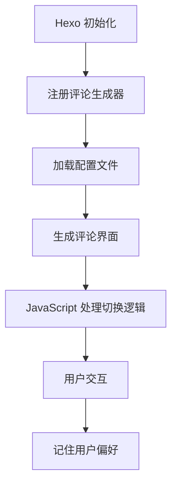

# Hexo Generator Comments

[](https://www.npmjs.com/package/hexo-generator-comments) [](https://hexo.io) [](https://github.com/huazie/diversity-plugins/blob/main/LICENSE) [](https://github.com/huazie/diversity-plugins/stargazers)

Hexo 多评论系统生成插件，支持多种评论系统的集成与切换，提供统一的评论界面。

## 功能特性

| 特性 | 描述 |
|------|------|
| **多评论系统支持** | 同时集成多种评论系统（Utterances、Gitalk、Giscus 等） |
| **选项卡式切换** | 优雅的选项卡界面，轻松在不同评论系统间切换 |
| **用户偏好记忆** | 智能记住访客选择的评论系统，提升用户体验 |
| **懒加载支持** | 可选懒加载机制，显著提高页面加载速度 |
| **主题无关性** | 完美兼容任何 Hexo 主题，无缝集成 |
| **自定义布局** | 灵活的布局和样式自定义选项 |
| **深色模式支持** | 内置深色模式样式，自动适应系统主题 |

## 快速开始

### 安装插件

```bash
npm install hexo-generator-comments --save
```

### 基本使用

1. **安装插件**后，在 Hexo 站点根目录的 `_config.yml` 中添加基本配置
2. **选择并配置**您需要的评论系统
3. **在主题中集成**评论组件
4. **启动站点**，访问 `/comments/` 路径查看效果

## 配置指南

### 基本配置

在 Hexo 站点根目录的 `_config.yml` 文件中添加以下配置：

```yaml
comments:
  # 自定义布局（可选）
  layout: 
  # 深色主题类名
  darkclass:
  # 多个评论系统启用时的展示风格，目前支持 tabs（选项卡）
  style: tabs
  # 默认显示的评论系统，可选值：utterances | gitalk | giscus 等
  active: utterances
  # 是否记住访客选择的评论系统
  storage: true
  # 是否懒加载评论系统
  lazyload: false
  # 导航元素的展示文本或顺序
  nav:
    utterances:
      text: Utterances
      order: 0
    gitalk:
      text: Gitalk
      order: 1
```

## 评论系统

本插件支持多种评论系统，以下是目前已支持的评论系统：

| 评论系统 | 特点 | 适用场景 |
|----------|------|----------|
| **Utterances** | 基于 GitHub Issues，轻量级 | 技术博客、开源项目 |
| **Gitalk** | 基于 GitHub Issues，功能丰富 | 个人博客、技术分享 |
| **Giscus** | 基于 GitHub Discussions，现代化 | 社区讨论、互动博客 |

### 评论系统安装和配置示例

#### Utterances

```bash
# 安装
npm install hexo-comments-utterances --save
```

```yaml
# Utterances
# 一个由开源社区构建的评论插件，它提供了一种在博客、文章或任何静态网站上添加互动式评论功能的高效解决方案。
# For more information: https://utteranc.es
utterances:
  # 可选值：true 【启用】 | false 【禁用】
  # Available values: true | false
  enable: false
  # 是否启用加载提示，可选值：true | false
  # Whether to enable loading indicator, Available values: true | false
  loading: true
  # GitHub 仓库所有者 user-name 和 名称 repo-name
  # Github repository owner and name
  repo: user-name/repo-name
  # 指定GitHub issue的匹配规则
  # Available values: pathname | url | title | og:title | `issue number` | `specific term`
  issue_term: pathname
  # 默认主题
  # Available values: github-light | github-dark | preferred-color-scheme | github-dark-orange | icy-dark | dark-blue | photon-dark | boxy-light
  theme: github-light
  # 深色主题
  # Dark Theme
  dark: github-dark
```

#### Gitalk

```bash
# 安装
npm install hexo-comments-gitalk --save
```

```yaml
# Gitalk
# 一个基于GitHub Issue和Preact开发的现代评论插件。
# 它允许网站访客使用GitHub账号登录并发表评论，所有评论数据都储存在相应的GitHub仓库中。
# For more information: https://gitalk.github.io
gitalk:
  # 可选值：true 【启用】 | false 【禁用】
  # Available values: true | false
  enable: false
  # GitHub 仓库所有者
  # GitHub repo owner 
  github_id: 
  # 用于存储评论issues的GitHub仓库名
  # Repository name to store issues
  repo: 
  # GitHub 应用客户端 ID
  # GitHub Application Client ID
  client_id: 
  # GitHub 应用客户端密钥
  # GitHub Application Client Secret
  client_secret: 
  # GitHub 仓库所有者和协作者，只有这些人可以创建 GitHub issues。
  # GitHub repo owner and collaborators, only these guys can initialize gitHub issues
  admin_user: 
  # 类似 Facebook 的免打扰模式
  # Facebook-like distraction free mode
  distraction_free_mode: true 
  # 当官方代理不可用时，您可以将其更改为自己的代理地址。
  # When the official proxy is not available, you can change it to your own proxy address
  # 下面是官方代理地址
  # This is official proxy address
  proxy: https://cors-anywhere.azm.workers.dev/https://github.com/login/oauth/access_token
  # 指定GitHub issue的匹配规则
  # 其中 pathname | url | title 用来匹配 issue 的标签，`issue number` 是 issue的编号（一个正数）
  # Available values: pathname | url | title | `issue number`
  issue_term: pathname
  # Gitalk 的显示语言取决于用户的浏览器或系统环境。
  # Gitalk's display language depends on user's browser or system environment
  # 如果您希望所有访问您网站的用户看到统一的语言，您可以设置一个强制语言值。
  # If you want everyone visiting your site to see a uniform language, you can set a force language value
  # Available values: en | es-ES | fr | ru | zh-CN | zh-TW
  language:
```

#### Giscus

```bash
# 安装
npm install hexo-comments-giscus --save
```

```yaml
# Giscus
# 一个利用 GitHub Discussions 实现的评论系统
# For more information: https://giscus.app/
giscus:
  # 可选值：true 【启用】 | false 【禁用】
  # Available values: true | false
  enable: false
  # 是否启用加载提示，可选值：true | false
  # Whether to enable loading indicator, Available values: true | false
  loading: true
  # GitHub 仓库名称，指定评论数据存储在哪个 GitHub 仓库的 Discussions 中。
  # Github repository name
  repo: your-username/your-repo-name
  # GitHub 仓库的唯一ID
  # 调用 GitHub API https://api.github.com/repos/your-username/your-repo-name，
  # 返回的 JSON 中 node_id 字段即为仓库 ID
  # Github repository id
  repo_id: 
  # GitHub Discussions 分类名称。将评论归类到特定讨论板块，方便管理
  # Github discussion category
  category: 
  # Discussions 分类的唯一 ID。 需从 GitHub 获取，与 category 配合使用
  # Github discussion category id
  category_id: 
  # 指定GitHub discussion的匹配规则
  # 可选值： pathname | url | title | og:title | specific
  # Available values: pathname | url | title | og:title | specific
  mapping: pathname
  # 当 mapping 为 specific 时，该值必须配置，如下：
  # - Discussion 的标题包含特定字符串
  # - 特定 discussion 号
  term: 
  # 是否启用严格的标题匹配。当有多个具有相似标题的讨论时，避免由于 GitHub 的模糊搜索方法而导致的不匹配。
  # 可选值: 0（关闭）| 1（启用）
  # Available values: 0 | 1
  strict: 0
  # 是否启用主帖子上的反应。启用后，Discussion 的主帖子上的反应将会显示在评论前
  # 可选值：0（关闭）| 1（启用）
  # Available values: 0 | 1
  reactions_enabled: 1
  # 是否输出 discussion 的元数据。Discussion 的元数据将定期被发送到父页面（被嵌入的页面）。
  # 可选值：0（否）| 1（是）
  # Available values: 0 | 1
  emit_metadata: 0
  # 评论区的主题样式(默认主题)
  # 可选值：light | light_high_contrast | light_protanopia | light_tritanopia | dark | dark_high_contrast | dark_protanopia | dark_tritanopia | dark_dimmed | preferred_color_scheme | transparent_dark | noborder_light | noborder_dark | noborder_gray | cobalt | purple_dark
  # Available values: light | light_high_contrast | light_protanopia | light_tritanopia | dark | dark_high_contrast | dark_protanopia | dark_tritanopia | dark_dimmed | preferred_color_scheme | transparent_dark | noborder_light | noborder_dark | noborder_gray | cobalt | purple_dark
  theme: light
  # 深色主题
  # Dark Theme
  dark: dark
  # 评论区的语言（界面文本） 如果配置为空，则取 window.navigator.language
  # 可选值：zh-CN | zh-TW | en | es-ES | fr | ru 
  # Available values: zh-CN | zh-TW | en | es-ES | fr | ru 
  lang: 
  # 评论输入框的位置
  # 可选值：
  # bottom-将评论输入框固定在页面的底部（评论列表下方）
  # top-将评论输入框固定在页面的顶部（评论列表上方）
  # Place the comment box above the comments
  input_position: bottom
  # 懒加载评论
  # Load the comments lazily
  data_loading: lazy
```

## 主题集成

### 支持的模板引擎

本插件支持所有使用以下模板引擎的 Hexo 主题：

| 模板引擎 | 文件扩展名 | 支持状态 |
|----------|------------|----------|
| **EJS** | `.ejs` | ✅ 完全支持 |
| **Nunjucks** | `.njk` | ✅ 完全支持 |

### 集成步骤

#### 1. 预览效果
- **本地开发**：访问 `http://127.0.0.1:4000/comments/`
- **生产环境**：访问 `https://your-domain.com/comments/`

#### 2. 主题集成代码

**EJS 主题集成**

```ejs
<% if (page.comments) { %>
    <%- partial('comments') %>
<% } %>
```

**Nunjucks 主题集成**

```njk

    {{ partial('comments') }}

```

#### 3. 禁用特定页面评论

在不需要显示评论的页面 Front Matter 中添加：

```yaml
---
title: 文章标题
date: 2021-01-01 12:00:00
comments: false  # 禁用评论
---
```

> **注意**：实测，Hexo 中 `page.comments` 默认为 `true`

### 兼容性特性

- ✅ **主题无关**：与支持所有使用 EJS、Nunjucks 等模板引擎的 Hexo 主题兼容
- ✅ **深色模式**：支持深色/浅色主题切换
- ✅ **响应式设计**：完美支持多终端设备显示

## 工作原理



1. **初始化阶段**：插件在 Hexo 启动时注册生成器和过滤器
2. **配置加载**：读取 `_config.yml` 中的评论系统配置
3. **界面生成**：创建统一的评论界面，支持多系统切换
4. **交互处理**：通过 JavaScript 处理评论系统的加载和切换
5. **偏好记忆**：本地存储用户选择的评论系统

## 高级配置

### 自定义评论布局

1. 在主题目录中创建自定义布局文件：
   ```
   themes/your-theme/layout/_custom/comments.ejs
   ```

2. 在 `_config.yml` 中指定自定义布局：
   ```yaml
   comments:
     layout: _custom/comments
   ```

### 扩展评论系统

本插件采用模块化设计，支持添加新的评论系统：

| 现有插件 | 仓库地址 | 状态 |
|----------|----------|------|
| hexo-comments-utterances | [GitHub](https://github.com/huazie/diversity-plugins/packages/hexo-comments-utterances) | ✅ 稳定 |
| hexo-comments-gitalk | [GitHub](https://github.com/huazie/diversity-plugins/packages/hexo-comments-gitalk) | ✅ 稳定 |
| hexo-comments-giscus | [GitHub](https://github.com/huazie/diversity-plugins/packages/hexo-comments-giscus) | ✅ 稳定 |

### 明暗模式切换

Diversity.js 中 Diversity.utils 提供的 `toggleColorScheme` 方法可以实现明暗模式切换。

在你接入的 Hexo 主题的切换明暗模式的代码逻辑中，添加如下调用：

```javascript
// 切换评论区域的明暗模式
Diversity.utils.toggleColorScheme();
```

## 系统要求
| 依赖 | 版本要求 | 说明 |
|------|----------|------|
| **Node.js** | >= 14.0.0 | JavaScript 运行环境 |
| **Hexo** | >= 5.3.0 | 静态站点生成器 |
| **@next-theme/utils** | ^1.3.0 | 主题工具库 |
| **hexo-util** | ^3.0.1 | Hexo 工具库 |

## 贡献指南

我们欢迎所有形式的贡献！

### 贡献方式

- 🐛 **报告 Bug**：[提交 Issue](https://github.com/huazie/diversity-plugins/issues)
- 💡 **功能建议**：[功能请求](https://github.com/huazie/diversity-plugins/issues)
- 🔧 **代码贡献**：[提交 Pull Request](https://github.com/huazie/diversity-plugins/pulls)
- 📖 **文档改进**：帮助完善文档

### 开发指南

1. Fork 本仓库
2. 创建功能分支：`git checkout -b feature/amazing-feature`
3. 提交更改：`git commit -m 'Add amazing feature'`
4. 推送分支：`git push origin feature/amazing-feature`
5. 提交 Pull Request

## 许可证

本项目基于 [MIT](LICENSE) 许可证开源。

---

<div align="center">

**如果这个插件对您有帮助，请考虑给我们一个 ⭐**

Made with ❤️ by [huazie](https://github.com/huazie)

</div>