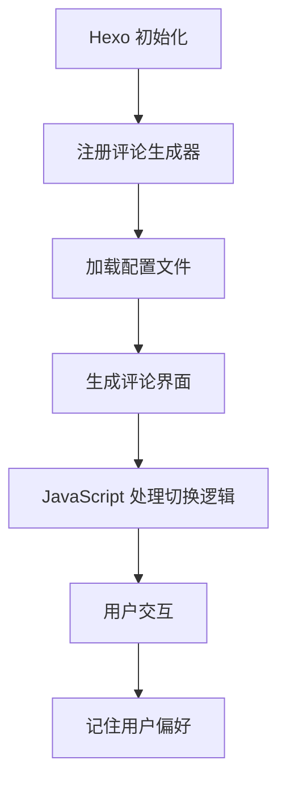

# Hexo Generator Comments

[](https://www.npmjs.com/package/hexo-generator-comments) [](https://hexo.io) [](https://github.com/huazie/diversity-plugins/blob/main/LICENSE) [](https://github.com/huazie/diversity-plugins/stargazers)

Hexo 多评论系统生成插件，支持多种评论系统的集成与切换，提供统一的评论界面。

[英文说明/English Documentation](README_EN.md)

## 功能特性

| 特性 | 描述 |
|------|------|
| **多评论系统支持** | 同时集成多种评论系统（Utterances、Gitalk、Giscus、Twikoo、Gitment 等） |
| **选项卡式切换** | 优雅的选项卡界面，轻松在不同评论系统间切换 |
| **用户偏好记忆** | 智能记住访客选择的评论系统，提升用户体验 |
| **懒加载支持** | 可选懒加载机制，显著提高页面加载速度 |
| **主题无关性** | 完美兼容任何 Hexo 主题，无缝集成 |
| **自定义布局** | 灵活的布局和样式自定义选项 |
| **深色模式支持** | 内置深色模式样式，自动适应系统主题 |

## 快速开始

### 安装插件

```bash
npm install hexo-generator-comments --save
```

### 基本使用

1. **安装插件**后，在 Hexo 站点根目录的 `_config.yml` 中添加基本配置
2. **选择并配置**您需要的评论系统
3. **在主题中集成**评论组件
4. **启动站点**，访问 `/comments/` 路径查看效果

## 配置指南

### 基本配置

在 Hexo 站点根目录的 `_config.yml` 文件中添加以下配置：

```yaml
comments:
  title: 
  layout: 
  path: 
  darkclass:
  style: tabs
  active: 
  storage: true
  lazyload: false
  nav:
    #utterances:
    #  text: Utterances
    #  order: 0
    #gitalk:
    #  order: 1
```

- **comments** - 评论系统配置
  - **title** - 自定义评论标题（可选，默认为"Comments"）
  - **layout** - 自定义评论布局文件名（可选，不包含扩展名）
  - **path** - 自定义评论页面路径（可选，默认为 `comments`）
  - **darkclass** - 深色主题类名（可选）
  - **style** - 多个评论系统启用时，选择一个默认展示风格。可选值：`tabs` 【选项卡】 | `dropdown` 【下拉菜单】
  - **active** - 选择一个默认显示的评论系统。可选值：`utterances` | `gitalk` | `giscus` | `twikoo` | `gitment` 等等
  - **storage** - 是否记住访客选择的评论系统，可选值： `true` | `false`。设置为 `true` 意味着记住访客选择的评论系统。
  - **lazyload** - 是否懒加载评论系统，可选值： `true` | `false`
  - **nav** - 调整导航元素的展示文本或顺序
    - **`utterances`** - 评论系统名，参考各评论系统定义即可
      - **text** - 导航元素的展示文本【选填】，默认为评论系统名
      - **order** - 导航元素的展示顺序【数字越大，展示越靠后】

## 评论系统

本插件支持多种评论系统，以下是目前已支持的评论系统：

| 评论系统 | 特点 | 适用场景 |
|----------|------|----------|
| **Utterances** | 基于 GitHub Issues，轻量级 | 技术博客、开源项目 |
| **Gitalk** | 基于 GitHub Issues，功能丰富 | 个人博客、技术分享 |
| **Giscus** | 基于 GitHub Discussions，现代化 | 社区讨论、互动博客 |
| **Twikoo** | 免费私有部署，简洁安全 | 数据自主可控、个人博客 |
| **Gitment** | 基于 GitHub Issues，轻量级 | 个人博客、技术分享 |

### 评论系统安装和配置示例

#### Utterances

```bash
# 安装
npm install hexo-comments-utterances --save
```

```yaml
# Utterances
# 一个由开源社区构建的评论插件，它提供了一种在博客、文章或任何静态网站上添加互动式评论功能的高效解决方案。
# For more information: https://utteranc.es
utterances:
  enable: false
  loading: true
  repo: user-name/repo-name
  issue_term: pathname
  theme: github-light
  dark: github-dark
```

- **utterances** - Utterances 配置，更多信息查看：https://utteranc.es
  - **enable** - 是否启用，可选值： `true` | `false`
  - **loading** - 是否启用加载提示，可选值：`true` | `false`
  - **repo** - GitHub仓库所有者和名称
  - **issue_term** - 指定issue的匹配规则，可选值： `pathname` | `url` | `title` | `og:title` | `issue number` | `specific term`
    - **`pathname`** - issue标题包含页面路径名。Utterances 会搜索标题包含页面路径名的issue。如果未找到匹配的议题，当有人首次发表评论时，Utterances 将自动创建一个。
    - **`url`** - issue标题包含页面URL。Utterances 会搜索标题包含页面URL 的issue。如果未找到匹配的议题，当有人首次发表评论时，Utterances 将自动创建一个。
    - **`title`** - issue标题包含页面标题。Utterances 会搜索标题包含页面标题的issue。如果未找到匹配的议题，当有人首次发表评论时，Utterances 将自动创建一个。
    - **`og:title`** - issue标题包含页面 `og:title`。Utterances 会搜索标题包含页面 Open Graph 标题元数据的issue。如果未找到匹配的议题，当有人首次发表评论时，Utterances 将自动创建一个。
    - **`issue number`** - 特定issue编号。您可以通过该编号配置 Utterances 以加载特定issue。不会自动创建issue。
    - **`specific term`** - issue标题包含特定术语。您可以配置 Utterances 以搜索标题包含您配置的特定术语的issue。如果未找到匹配的议题，当有人首次发表评论时，Utterances 将自动创建一个，且该issue的标题将是您设置的术语。
  - **theme** - Utterances 默认主题，可选值： `github-light` | `github-dark` | `preferred-color-scheme` | `github-dark-orange` | `icy-dark` | `dark-blue` | `photon-dark` | `boxy-light`
  - **dark** - Utterances 深色主题

#### Gitalk

```bash
# 安装
npm install hexo-comments-gitalk --save
```

```yaml
# Gitalk
# 一个基于GitHub Issue和Preact开发的现代评论插件。
# 它允许网站访客使用GitHub账号登录并发表评论，所有评论数据都储存在相应的GitHub仓库中。
# For more information: https://gitalk.github.io
gitalk:
  enable: false
  loading: true
  github_id: 
  repo: 
  client_id: 
  client_secret: 
  admin_user: 
  distraction_free_mode: true
  proxy: https://cors-anywhere.azm.workers.dev/https://github.com/login/oauth/access_token
  issue_term: pathname
  language:
```

- **gitalk** - Gitalk 配置，更多信息查看：https://gitalk.github.io/
  - **enable** - 是否启用，可选值： `true` | `false`
  - **loading** - 是否启用加载提示，可选值：`true` | `false`
  - **github_id** - GitHub 仓库所有者
  - **repo** - 用于存储评论issues的 GitHub 仓库名
  - **client_id** - GitHub 应用客户端 ID
  - **client_secret** - GitHub 应用客户端密钥
  - **admin_user** - GitHub 仓库所有者和协作者，只有这些人可以创建 GitHub issues。
  - **distraction_free_mode** - 类似 Facebook 的免打扰模式，可选值： `true` | `false`
  - **proxy** - 代理地址。当官方代理不可用时，您可以将其更改为自己的代理地址。
  - **issue_term** - 指定issue的匹配规则，可选值： `pathname` | `url` | `title` | `issue number`
    - **`pathname`** - issue的标签包含页面路径名。
    - **`url`** - issue的标签包含页面URL。
    - **`title`** - issue的标签包含页面标题。
    - **`issue number`** - 特定issue编号。您可以通过该编号配置 Gitalk 以加载特定issue。
  - **language** - Gitalk 的显示语言取决于用户的浏览器或系统环境。如果您希望所有访问您网站的用户看到统一的语言，您可以设置一个强制语言值。 可选值：`zh-CN` | `zh-TW` | `en` | `es-ES` | `fr` | `ru`

#### Giscus

```bash
# 安装
npm install hexo-comments-giscus --save
```

```yaml
# Giscus
# 一个利用 GitHub Discussions 实现的评论系统
# For more information: https://giscus.app/
giscus:
  enable: false
  loading: true
  repo: your-username/your-repo-name
  repo_id: 
  category: 
  category_id: 
  mapping: pathname
  term: 
  strict: 0
  reactions_enabled: 1
  emit_metadata: 0
  theme: light
  dark: dark
  lang: 
  input_position: bottom
  data_loading: lazy
```

- **giscus** - Giscus 配置，更多信息查看：https://giscus.app/
  - **enable** - 是否启用，可选值： `true` | `false`
  - **loading** - 是否启用加载提示，可选值：`true` | `false`
  - **repo** - GitHub 仓库名称【格式：用户名/仓库名】，指定评论数据存储在哪个 GitHub 仓库的 Discussions 中。
  - **repo_id** - GitHub 仓库的唯一ID。用户可以在 https://giscus.app/ 填写仓库后查看`<script>`内容。
  - **category** - GitHub Discussions 分类名称。将评论归类到特定讨论板块，方便管理。可选值： `Announcements` | `General` | `Ideas` | `Polls` | `Q&A` | `Show and tell`
  - **category_id** - Discussions 分类的唯一 ID。用户可以在 https://giscus.app/ 选择Discussion 分类后查看`<script>`内容。
  - **mapping** - 指定GitHub discussion的匹配规则，可选值： `pathname` | `url` | `title` | `og:title` | `specific`
    - **`pathname`** - Discussion 的标题包含页面的 pathname。giscus 将查找标题中包含页面 URL 的 pathname 部分的 discussion。
    - **`url`** - Discussion 的标题包含页面的 URL。giscus 将查找标题中包含页面 URL 的 discussion。
    - **`title`** - Discussion 的标题包含页面的 `<title>`。giscus 将查找标题中包含页面的 `<title>` 标签的 discussion。
    - **`og:title`** - Discussion 的标题包含页面的 og:title。giscus 将查找标题中包含页面的 `<meta property="og:title">`标签的 discussion。
    - **`specific`** - 特别指定，需要搭配 **term** 配置属性使用。
  - **term** - 指定GitHub discussion的匹配值，当 mapping 为 `specific` 时，该值必须配置，如下：
    - Discussion 的标题包含特定字符串
    - 特定 Discussion 号
  - **strict** - 是否启用严格的标题匹配。当有多个具有相似标题的讨论时，避免由于 GitHub 的模糊搜索方法而导致的不匹配。可选值: 0（关闭）| 1（启用）
  - **reactions_enabled** - 是否启用主帖子上的反应。启用后，Discussion 的主帖子上的反应将会显示在评论前。可选值：0（关闭）| 1（启用）
  - **emit_metadata** - 是否输出 discussion 的元数据。Discussion 的元数据将定期被发送到父页面（被嵌入的页面）。
  - **theme** - Giscus 默认主题，可选值：`light` | `light_high_contrast` | `light_protanopia` | `light_tritanopia` | `dark` | `dark_high_contrast` | `dark_protanopia` | `dark_tritanopia` | `dark_dimmed` | `preferred_color_scheme` | `transparent_dark` | `noborder_light` | `noborder_dark` | `noborder_gray` | `cobalt` | `purple_dark`
  - **dark** - Giscus 深色主题
  - **lang** - 评论区的语言（界面文本）。如果配置为空，则取 `window.navigator.language`。 可选值：`zh-CN` | `zh-TW` | `en` | `es-ES` | `fr` | `ru`
  - **input_position** - 评论输入框的位置，可选值：
    - **`bottom`** - 将评论输入框固定在页面的底部（评论列表下方）
    - **`top`** - 将评论输入框固定在页面的顶部（评论列表上方）
  - **data_loading** - 懒加载评论。评论的加载将延迟到用户滚动到评论容器附近。 这是通过将 loading="lazy" 添加到 `<iframe>` 元素来完成的。

#### Twikoo

```bash
# 安装
npm install hexo-comments-twikoo --save
```

```yaml
# Twikoo
# 一个简洁、安全、免费的静态网站评论系统。
# For more information: https://twikoo.js.org/
twikoo:
  enable: false
  loading: true
  env_id: your-env-id
  region:
  path:
  lang: zh-CN
  js: https://cdn.jsdelivr.net/npm/twikoo@1.7.9/dist/twikoo.min.js
```

- **twikoo** - Twikoo 配置，更多信息查看：https://twikoo.js.org/
  - **enable** - 是否启用，可选值： `true` | `false`
  - **loading** - 是否启用加载提示，可选值：`true` | `false`
  - **env_id** - Twikoo 环境 ID（必填），在部署后台系统中获取
  - **region** - 环境地域。腾讯云环境填 `ap-shanghai` 或 `ap-guangzhou`；Vercel 环境不填
  - **path** - 页面路径，用于区分不同页面的评论，默认使用 `window.location.pathname`
  - **lang** - 评论区语言。可选值：`zh-CN` | `zh-TW` | `en` | `es-ES` | `fr` | `ru`，默认 `zh-CN`
  - **js** - Twikoo JS SDK CDN 地址，可指定特定版本或自部署地址

#### Gitment

```bash
# 安装
npm install hexo-comments-gitment --save
```

```yaml
# Gitment
# 一个基于 GitHub Issues 的轻量级评论插件。
# For more information: https://github.com/imsun/gitment
gitment:
  enable: false
  loading: true
  owner: your-github-id
  repo: your-repo-name
  client_id: your-client-id
  client_secret: your-client-secret
  issue_term: pathname
  per_page: 20
  max_comment_height: 250
  proxy:
```

- **gitment** - Gitment 配置，更多信息查看：https://github.com/imsun/gitment
  - **enable** - 是否启用，可选值： `true` | `false`
  - **loading** - 是否启用加载提示，可选值：`true` | `false`
  - **owner** - GitHub 仓库所有者的用户名
  - **repo** - 用于存储评论的 GitHub 仓库名
  - **client_id** - GitHub Application 的 Client ID
  - **client_secret** - GitHub Application 的 Client Secret
  - **issue_term** - 指定 issue 的匹配规则，可选值： `pathname` | `url` | `title`
    - **`pathname`** - 使用页面路径作为页面唯一标识，适合大多数场景（推荐）
    - **`url`** - 使用页面完整 URL 作为页面唯一标识
    - **`title`** - 使用页面标题作为页面唯一标识
  - **per_page** - 评论每页显示数量，默认 `20`
  - **max_comment_height** - 评论最大高度限制（px），超过则折叠，默认 `250`
  - **proxy** - OAuth 代理地址（可选）。Gitment 默认代理 `gh-oauth.imsun.net` 已失效，需自行部署 OAuth 代理服务，可使用 Netlify Functions 或 Vercel Serverless 方案

> **注意**：由于 Gitment 默认的 OAuth 代理已失效，**强烈建议**配置 `proxy` 代理地址，否则用户将无法登录评论。推荐使用 Netlify Functions 部署 OAuth 代理，详见 [Gitment 插件文档](../hexo-comments-gitment/README.md)。

## 主题集成

### 支持的模板引擎

本插件支持所有使用以下模板引擎的 Hexo 主题：

| 模板引擎 | 文件扩展名 | 支持状态 |
|----------|------------|----------|
| **EJS** | `.ejs` | ✅ 完全支持 |
| **Nunjucks** | `.njk` | ✅ 完全支持 |
| **JSX + Inferno** | `.jsx` | ✅ 完全支持 |

### 集成方式

#### 1. 主题接入直接访问
- **本地开发**：访问 `http://127.0.0.1:4000/comments/`
- **生产环境**：访问 `https://your-domain.com/comments/`

#### 2. 主题布局集成代码

**EJS 主题集成**

```ejs
<% if (page.comments) { %>
    <%- partial('comments') %>
<% } %>
```

**Nunjucks 主题集成**

```njk

    {{ partial('comments') }}

```

**JSX + Inferno 主题集成**

```diff
  const { Component } = require('inferno');
  const Article = require('./common/article');
+ const Comments = require('hexo-generator-comments/layout/comments')

  module.exports = class extends Component {
      render() {
-         const { config, page, helper } = this.props;
+         const { config, theme, page, helper } = this.props;

          return (
+             <div>
                  <Article config={config} page={page} helper={helper} index={false} />
+                 {page.comments && <Comments theme={theme} helper={helper} />}
+             </div>
          );
      }
  };
```

#### 3. 禁用特定页面评论

在不需要显示评论的页面 Front Matter 中添加：

```yaml
---
title: 文章标题
date: 2021-01-01 12:00:00
comments: false  # 禁用评论
---
```

> **注意**：实测，Hexo 中 `page.comments` 默认为 `true`

### 兼容性特性

- ✅ **主题无关**：与支持所有使用 EJS、Nunjucks 等模板引擎的 Hexo 主题兼容
- ✅ **深色模式**：支持深色/浅色主题切换
- ✅ **响应式设计**：完美支持多终端设备显示

## 工作原理


```mermaid
graph TD
    A[Hexo 初始化] --> B[注册评论生成器]
    B --> C[加载配置文件]
    C --> D[生成评论界面]
    D --> E[JavaScript 处理切换逻辑]
    E --> F[用户交互]
    F --> G[记住用户偏好]
```

1. **初始化阶段**：插件在 Hexo 启动时注册生成器和过滤器
2. **配置加载**：读取 `_config.yml` 中的评论系统配置
3. **界面生成**：创建统一的评论界面，支持多系统切换
4. **交互处理**：通过 JavaScript 处理评论系统的加载和切换
5. **偏好记忆**：本地存储用户选择的评论系统

## 高级配置

### 自定义评论布局

1. 在主题目录中创建自定义布局文件：
   ```
   themes/your-theme/layout/_custom/comments.ejs
   ```

2. 在 站点配置 `_config.yml` 或 主题配置 `_config.yml` 、`_config.[theme].yml` 中指定自定义布局：
   ```yaml
   comments:
     layout: _custom/comments
   ```

### 自定义默认标题

在 站点配置 `_config.yml` 或 主题配置 `_config.yml` 、`_config.[theme].yml` 中指定默认标题：

```yaml
comments:
  title: 评论
``` 

### 自定义评论页面路径

在 站点配置 `_config.yml` 或 主题配置 `_config.yml` 、`_config.[theme].yml` 中指定评论页面路径：

```yaml
comments:
  path: custom/comments
```

可以通过 http://127.0.0.1:4000/custom/comments/ 访问评论页面

### 扩展评论系统

本插件采用模块化设计，支持添加新的评论系统：

| 现有插件 | 仓库地址 | 状态 |
|----------|----------|------|
| hexo-comments-utterances | [GitHub](https://github.com/huazie/diversity-plugins/packages/hexo-comments-utterances) | ✅ 稳定 |
| hexo-comments-gitalk | [GitHub](https://github.com/huazie/diversity-plugins/packages/hexo-comments-gitalk) | ✅ 稳定 |
| hexo-comments-giscus | [GitHub](https://github.com/huazie/diversity-plugins/packages/hexo-comments-giscus) | ✅ 稳定 |
| hexo-comments-twikoo | [GitHub](https://github.com/huazie/diversity-plugins/packages/hexo-comments-twikoo) | ✅ 稳定 |
| hexo-comments-gitment | [GitHub](https://github.com/huazie/diversity-plugins/packages/hexo-comments-gitment) | ✅ 稳定 |

### 明暗模式切换

`Diversity.js` 中 `Diversity.utils` 提供的 `toggleColorScheme` 方法可以实现明暗模式切换。

在你接入的 Hexo 主题的切换明暗模式的代码逻辑中，添加如下调用：

```javascript
// 切换评论区域的明暗模式
Diversity.utils.toggleColorScheme();
```

## 贡献指南

我们欢迎所有形式的贡献！

### 贡献方式

- 🐛 **报告 Bug**：[提交 Issue](https://github.com/huazie/diversity-plugins/issues)
- 💡 **功能建议**：[功能请求](https://github.com/huazie/diversity-plugins/issues)
- 🔧 **代码贡献**：[提交 Pull Request](https://github.com/huazie/diversity-plugins/pulls)
- 📖 **文档改进**：帮助完善文档

### 开发指南

1. Fork 本仓库
2. 创建功能分支：`git checkout -b feature/amazing-feature`
3. 提交更改：`git commit -m 'Add amazing feature'`
4. 推送分支：`git push origin feature/amazing-feature`
5. 提交 Pull Request

## 许可证

本项目基于 [MIT](LICENSE) 许可证开源。

---

<div align="center">

**如果这个插件对您有帮助，请考虑给我们一个 ⭐**

Made with ❤️ by [huazie](https://github.com/huazie)

</div>