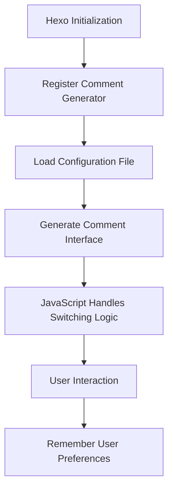

# Hexo Generator Comments

[](https://www.npmjs.com/package/hexo-generator-comments) [](https://hexo.io) [](https://github.com/huazie/diversity-plugins/blob/main/LICENSE) [](https://github.com/huazie/diversity-plugins/stargazers)

Hexo multi-comment system generator plugin, supporting integration and switching of multiple comment systems, providing a unified comment interface.

[中文说明/Chinese Documentation](README.md)

## Features

| Feature | Description |
|------|------|
| **Multi-comment System Support** | Integrate multiple comment systems (Utterances, Gitalk, Giscus, etc.) simultaneously |
| **Tab-based Switching** | Elegant tab interface for easy switching between different comment systems |
| **User Preference Memory** | Intelligently remembers the comment system chosen by visitors, enhancing user experience |
| **Lazy Loading Support** | Optional lazy loading mechanism to significantly improve page load speed |
| **Theme Agnostic** | Perfectly compatible with any Hexo theme, seamless integration |
| **Custom Layout** | Flexible layout and style customization options |
| **Dark Mode Support** | Built-in dark mode styles, automatically adapting to system theme |

## Quick Start

### Install the Plugin

```bash
npm install hexo-generator-comments --save
```

### Basic Usage

1. After **installing the plugin**, add the basic configuration in the `_config.yml` file at the root of your Hexo site.
2. **Select and configure** the comment system you need.
3. **Integrate the comment component** into your theme.
4. **Start the site** and visit the `/comments/` path to see the effect.

## Configuration Guide

### Basic Configuration

Add the following configuration in the `_config.yml` file at the root of your Hexo site:

```yaml
comments:
  title: 
  layout: 
  path: 
  darkclass:
  style: tabs
  active: 
  storage: true
  lazyload: false
  nav:
    utterances:
      text: Utterances
      order: 0
    gitalk:
      text: Gitalk
      order: 1
```

- **comments** - Comment System Configuration
  - **title** - Custom comment title (optional, default is "Comments")
  - **layout** - Custom comment layout file name (optional, without extension)
  - **path** - Custom comment page path (optional, default is `comments`)
  - **darkclass** - Dark theme class name (optional)
  - **style** - When multiple comment systems are enabled, choose a default display style. Options: `tabs` (tab-based)
  - **active** - Choose a default comment system to display. Options: `utterances` | `gitalk`
  - **storage** - Whether to remember the comment system chosen by visitors. Options: `true` | `false`. Set to `true` to remember the visitor's choice.
  - **lazyload** - Whether to enable lazy loading for comment systems. Options: `true` | `false`
  - **nav** - Adjust the display text or order of navigation elements
    - **`utterances`** - Comment system name
      - **text** - Display text for the navigation element (optional, defaults to the comment system name)
      - **order** - Display order of the navigation element (higher numbers appear later)

## Supported Comment Systems

The plugin supports multiple comment systems. Here are the currently supported ones:

| Comment System | Features | Use Cases |
|----------|------|----------|
| **Utterances** | Lightweight, based on GitHub Issues | Technical blogs, open-source projects |
| **Gitalk** | Feature-rich, based on GitHub Issues | Personal blogs, technical sharing |
| **Giscus** | Modern, based on GitHub Discussions | Community discussions, interactive blogs |

### Installation and Configuration Examples

#### Utterances

```bash
# Install
npm install hexo-comments-utterances --save
```

```yaml
# Utterances
# A comment plugin built by the open-source community, providing an efficient solution for adding interactive comments to blogs, articles, or any static website.
# For more information: https://utteranc.es
utterances:
  # Options: true (enable) | false (disable)
  enable: false
  # Whether to enable loading indicator. Options: true | false
  loading: true
  # GitHub repository owner and name
  repo: user-name/repo-name
  # GitHub issue matching rule
  # Available values: pathname | url | title | og:title | `issue number` | `specific term`
  issue_term: pathname
  # Default theme
  # Available values: github-light | github-dark | preferred-color-scheme | github-dark-orange | icy-dark | dark-blue | photon-dark | boxy-light
  theme: github-light
  # Dark theme
  dark: github-dark
```

#### Gitalk

```bash
# Install
npm install hexo-comments-gitalk --save
```

```yaml
# Gitalk
# A modern comment plugin based on GitHub Issues and Preact.
# It allows visitors to log in with their GitHub account and post comments, with all comment data stored in the corresponding GitHub repository.
# For more information: https://gitalk.github.io
gitalk:
  # Options: true (enable) | false (disable)
  enable: false
  # GitHub repository owner
  github_id: 
  # Repository name to store issues
  repo: 
  # GitHub Application Client ID
  client_id: 
  # GitHub Application Client Secret
  client_secret: 
  # GitHub repository owner and collaborators (only these users can initialize GitHub issues)
  admin_user: 
  # Facebook-like distraction-free mode
  distraction_free_mode: true 
  # Proxy URL (if the official proxy is unavailable)
  proxy: https://cors-anywhere.azm.workers.dev/https://github.com/login/oauth/access_token
  # GitHub issue matching rule
  # Available values: pathname | url | title | `issue number`
  issue_term: pathname
  # Language settings
  # Available values: en | es-ES | fr | ru | zh-CN | zh-TW
  language:
```

#### Giscus

```bash
# Install
npm install hexo-comments-giscus --save
```

```yaml
# Giscus
# A comment system implemented using GitHub Discussions.
# For more information: https://giscus.app/
giscus:
  # Options: true (enable) | false (disable)
  enable: false
  # Whether to enable loading indicator. Options: true | false
  loading: true
  # GitHub repository name (where comments are stored)
  repo: your-username/your-repo-name
  # GitHub repository ID
  repo_id: 
  # GitHub Discussions category name
  category: 
  # GitHub Discussions category ID
  category_id: 
```

## Theme Integration

### Supported Template Engines

This plugin supports all Hexo themes using the following template engines:

| Template Engine | File Extension | Support Status |
|-----------------|----------------|----------------|
| **EJS** | `.ejs` | ✅ Fully Supported |
| **Nunjucks** | `.njk` | ✅ Fully Supported |
| **JSX + Inferno** | `.jsx` | ✅ Fully Supported |

### Integration Methods

#### 1. Direct Access via Theme Integration
- **Local Development**: Access `http://127.0.0.1:4000/comments/`
- **Production Environment**: Access `https://your-domain.com/comments/`

#### 2. Theme Layout Integration Code

**EJS Theme Integration**

```ejs
<% if (page.comments) { %>
    <%- partial('comments') %>
<% } %>
```

**Nunjucks Theme Integration**

```njk

    {{ partial('comments') }}

```

**JSX + Inferno Theme Integration**

```diff
  const { Component } = require('inferno');
  const Article = require('./common/article');
+ const Comments = require('hexo-generator-comments/layout/comments')

  module.exports = class extends Component {
      render() {
-         const { config, page, helper } = this.props;
+         const { config, theme, page, helper } = this.props;

          return (
+             <div>
                  <Article config={config} page={page} helper={helper} index={false} />
+                 {page.comments && <Comments theme={theme} helper={helper} />}
+             </div>
          );
      }
  };
```

#### 3. Disable Comments on Specific Pages

Add to the Front Matter of pages where comments should not be displayed:

```yaml
---
title: Article Title
date: 2021-01-01 12:00:00
comments: false  # Disable comments
---
```

> **Note**: In Hexo, `page.comments` defaults to `true`

### Compatibility Features

- ✅ **Theme Agnostic**: Compatible with all Hexo themes using EJS, Nunjucks, and other template engines
- ✅ **Dark Mode**: Supports dark/light theme switching
- ✅ **Responsive Design**: Perfectly supports multi-device display

## How It Works



1. **Initialization Phase**: Plugin registers generators and filters when Hexo starts
2. **Configuration Loading**: Reads comment system configuration from `_config.yml`
3. **Interface Generation**: Creates unified comment interface supporting multiple systems
4. **Interaction Handling**: Processes comment system loading and switching via JavaScript
5. **Preference Memory**: Locally stores user-selected comment system

## Advanced Configuration

### Custom Comment Layout

1. Create custom layout file in theme directory:
   ```
   themes/your-theme/layout/_custom/comments.ejs
   ```

2. Specify custom layout in the site configuration `_config.yml` or theme configuration `_config.yml`, `_config.[theme].yml`:
   ```yaml
   comments:
     layout: _custom/comments
   ```

### Custom Default Title

Specify the default title in the site configuration `_config.yml` or theme configuration `_config.yml`, `_config.[theme].yml`:

```yaml
comments:
  title: Comments
```

### Custom Comment Page Path

Specify the comment page path in the site configuration `_config.yml` or theme configuration `_config.yml`, `_config.[theme].yml`:

```yaml
comments:
  path: custom/comments
```

The comment page can be accessed via: http://127.0.0.1:4000/custom/comments/

### Extending Comment Systems

This plugin uses modular design and supports adding new comment systems:

| Existing Plugin | Repository | Status |
|-----------------|------------|--------|
| hexo-comments-utterances | [GitHub](https://github.com/huazie/diversity-plugins/packages/hexo-comments-utterances) | ✅ Stable |
| hexo-comments-gitalk | [GitHub](https://github.com/huazie/diversity-plugins/packages/hexo-comments-gitalk) | ✅ Stable |
| hexo-comments-giscus | [GitHub](https://github.com/huazie/diversity-plugins/packages/hexo-comments-giscus) | ✅ Stable |

### Light/Dark Mode Toggle

The `toggleColorScheme` method provided by `Diversity.utils` in `Diversity.js` enables light/dark mode switching.

Add the following call in your Hexo theme's color scheme switching logic:

```javascript
// Toggle color scheme for comment area
Diversity.utils.toggleColorScheme();
```

## Contribution Guide

We welcome all forms of contributions!

### Ways to Contribute

- 🐛 **Report Bugs**: [Submit Issue](https://github.com/huazie/diversity-plugins/issues)
- 💡 **Feature Suggestions**: [Feature Requests](https://github.com/huazie/diversity-plugins/issues)
- 🔧 **Code Contributions**: [Submit Pull Request](https://github.com/huazie/diversity-plugins/pulls)
- 📖 **Documentation Improvements**: Help improve documentation

### Development Guide

1. Fork this repository
2. Create feature branch: `git checkout -b feature/amazing-feature`
3. Commit changes: `git commit -m 'Add amazing feature'`
4. Push branch: `git push origin feature/amazing-feature`
5. Submit Pull Request

## License

This project is open source under the [MIT](LICENSE) license.

---

<div align="center">

**If this plugin helps you, please consider giving us a ⭐**

Made with ❤️ by [huazie](https://github.com/huazie)

</div>